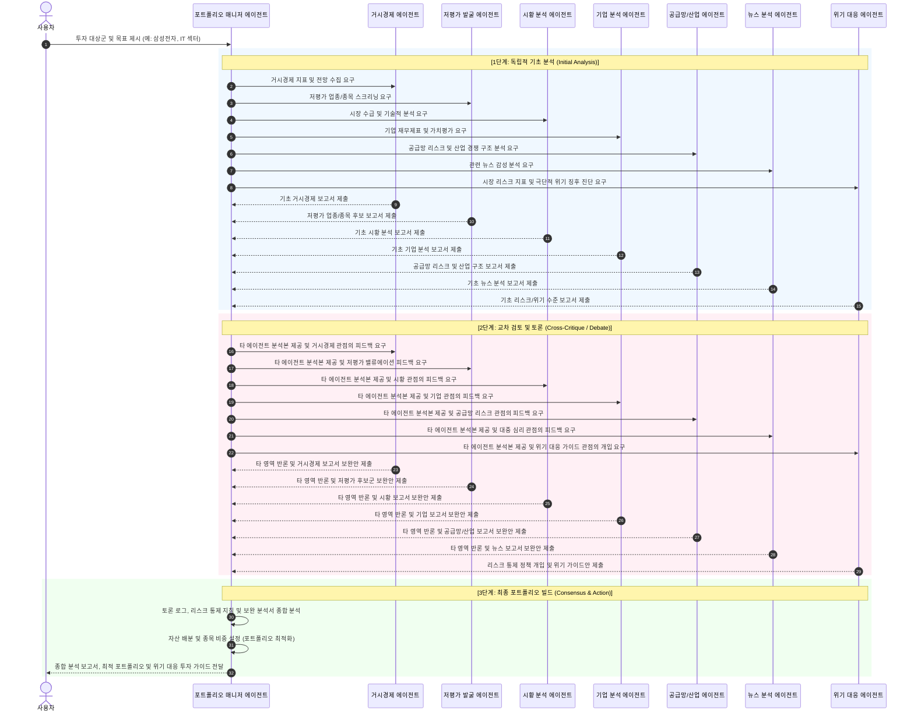
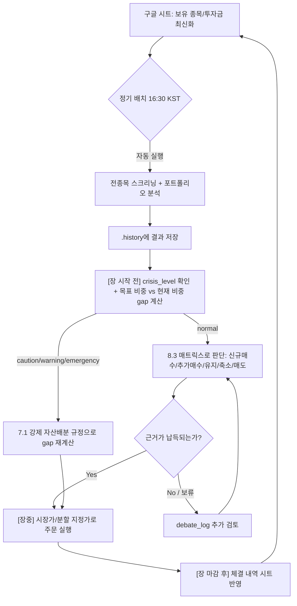

# AI 기반 스마트 주식 투자 에이전트 시스템 아키텍처 설계서

본 설계서는 거시경제, 시황, 기업 분석, 뉴스/감성 분석 데이터를 유기적으로 결합하여 최종 투자 의견 및 포트폴리오를 제안하는 **토론형 멀티 에이전트 시스템**의 설계 구조를 정의합니다.

---

## 1. 시스템 개요 (System Overview)

투자 의사결정은 단일 영역의 분석만으로 완전할 수 없습니다. 거시경제 지표가 좋아도 개별 기업의 펀더멘탈이 부실할 수 있고, 기업 실적이 좋아도 단기적인 부정적 뉴스나 시장 수급(시황)이 나쁠 수 있습니다. 또한, 전체 종목 중 어떤 기업과 업종이 실적 대비 저평가되어 있는지 필터링하는 양적(Quant) 분석도 필수적이며, 전쟁이나 전염병, 금융 충격(엔캐리 청산 등)과 같은 블랙 스완 상황에서 자산을 방어하기 위한 위기 대응 가이드도 갖추어야 합니다.
본 시스템은 각 분야의 분석 및 통제를 전문으로 하는 **7대 독립 에이전트**와 이들의 의견을 조율하고 최종 포트폴리오를 구성하는 **포트폴리오 매니저 에이전트**로 구성됩니다.

---

## 2. 핵심 아키텍처: 양방향 토론 워크플로우

단방향의 보고서 취합 방식을 탈피하여, 에이전트 간 피드백을 통해 의견을 조율하고 다각도로 검토된 최종 결과물을 도출하는 **양방향 토론(Debate & Consensus) 프로세스**를 채택합니다.

### 2.1 토론 시퀀스 다이어그램 (Sequence Diagram)



### 2.2 토론 단계별 상세 프로세스

1. **기초 분석 단계 (Initial Analysis)**:
   - 각 에이전트는 담당 영역의 데이터 소스(FRED, KRX, DART, 뉴스 크롤러 등)를 통해 정량/정성 데이터를 확보하고 독자적인 분석 리포트를 작성합니다.
2. **양방향 토론 단계 (Debate Phase)**:
   - 포트폴리오 매니저는 취합된 리포트들을 모아 모든 에이전트에게 전송합니다.
   - 각 에이전트는 다른 에이전트의 주장에 반론을 제기하거나 지원 사격을 합니다. 특히 위기 대응 에이전트는 극단적인 리스크 징후가 있을 때 강력한 '통제권'을 행사하여 토론에 개입합니다.
     - *예시 (거시경제 -> 기업)*: "현재 고금리 기조가 6개월 더 유지될 전망인데, 기업 분석 에이전트가 제시한 부채 비율이 높은 B기업의 순이익 추정치는 너무 낙관적입니다. 이자 비용 증가를 반영해 하향 조정해야 합니다."
     - *예시 (뉴스 -> 시황)*: "최근 3일간 반도체 업계 관련 미디어 감성 지수가 극도로 악화되었습니다. 시황 에이전트가 제시한 단기 골든크로스 매수 시그널은 뉴스 심리 반등 확인 전까지 유보하는 것을 권장합니다."
     - *예시 (위기 대응 -> 전체)*: "중동 지역 전쟁 위기 고조로 유가 폭등 및 공급망 병목이 우려됩니다. 현재 시점에서 주식 비중을 최소 20% 이상 강제 축소하고, 안전 자산(금, 달러) 편입을 지시합니다."
3. **최종 합의 및 포트폴리오 빌드 (Consensus & Optimization)**:
   - 에이전트들은 상대방의 합당한 비판 및 리스크 통제 정책을 수용하여 자신의 보고서를 최종 수정합니다.
   - 포트폴리오 매니저(PM)는 보완된 최종 의견들과 토론 과정의 로그, 그리고 위기 대응 에이전트가 제공하는 **'블랙스완 및 고변동성 국면 행동 강령(투자 가이드)'**을 종합 평가하여, 종목별 추천 강도, 구체적인 포트폴리오 편입 비중(예: 삼성전자 30%, 현대차 20%, 현금 50%) 및 위기 대응 투자 가이드를 최종 제안합니다.

---

## 3. 에이전트별 역할 및 데이터 설계 (Agent Roles & Data)

| 에이전트 명 | 역할 및 목표 (Goal) | 데이터 소스 (Data Sources) | 주요 분석 항목 (Focus) |
| :--- | :--- | :--- | :--- |
| **거시경제 에이전트**<br>(Macro Analyst) | 글로벌/국내 거시경제 환경을 분석하고 금리, 환율, 인플레이션 주기를 판단합니다. | FRED, 한국은행(ECOS), 관세청(수출입 통계), 야후 파이낸스 | 금리 방향성, 원/달러 환율 추이, 유가 등 원자재 가격, 물가지수(CPI/PPI), 고용 지표, 국내 수출입 동향(품목별/국가별 수출액 및 무역수지), GDP 성장률 |
| **저평가 발굴 에이전트**<br>(Valuation/Screener) | 업종 및 종목 전체를 모니터링하여 실적 대비 밸류에이션이 저평가된 1차 후보군을 발굴합니다. | KRX, Naver/FnGuide 금융 데이터, Fnguide 업종 지표, Yahoo Finance(해외 종목 스크리닝) | 업종별 평균 PER/PBR 대비 저평가주, 이익 성장률 대비 저평가주(PEG), 고ROE 및 고배당 저평가 매력도 스크리닝(국내+해외) |
| **시황 분석 에이전트**<br>(Market Analyst) | 증시의 단기/중기 수급, 기술적 지표, 섹터 로테이션 및 시장 변동성을 분석합니다. | KRX, 야후 파이낸스(국내외 지수) | 거래대금 추이, 외인/기관 수급 동향, 이동평균선/RSI/MACD 등 기술적 지표, 시장 변동성 지표(VIX, VKOSPI), 섹터별 상대 강도, 국내 증시와 미국 주요 지수(S&P500, 나스닥) 간 상관관계 |
| **기업 분석 에이전트**<br>(Company Analyst) | 발굴된 후보 기업들의 정밀 재무 건전성, 세부 실적 추이, 고유 비즈니스 해자(Moat)를 심층 분석합니다. | DART(전자공시), Naver/FnGuide 금융 데이터, SEC EDGAR/Yahoo Finance(해외 종목 재무 데이터) | 분기 실적 및 세부 항목(매출원가, 판관비 등), 재무 비율 추이, 사업보고서 공시 분석, 개별 리스크 요인 진단, 배당성향 및 잉여현금흐름(FCF) 대비 배당 커버리지(배당 지속가능성 진단) |
| **공급망/산업 에이전트**<br>(Supply Chain Analyst) | 핵심 원자재·부품의 공급망 리스크와 산업 내 경쟁 구도, 업황 사이클을 진단하여 기업 분석에 선행 정보를 제공합니다. | 관세청(품목별 수출입 통계), 산업별 협회 통계, 경쟁사 공시(DART), 업종 리서치 리포트 | 원자재 가격 및 조달 리스크, 경쟁사 점유율 변화, 산업 사이클(업황 호황/불황) 판단, 대체 공급처 여부 및 공급망 병목 조기 감지 |
| **뉴스/감성 에이전트**<br>(News/Sentiment) | 언론사 뉴스 및 커뮤니티 감성 분석을 통해 대중 심리, 시장의 공포/탐욕 수준 및 비정형 리스크를 조기 탐지합니다. | 네이버 뉴스 검색 API, 경제지 RSS, 구글 뉴스, CNN Fear & Greed | 최근 주요 뉴스 키워드 빈도, 뉴스 제목 및 본문 감성 점수(Positive/Negative), 대중 심리 지표(공포와 탐욕 지수), 부정적 루머/리스크 탐지 |
| **위기 대응 에이전트**<br>(Crisis & Risk Manager) | 전쟁, 팬데믹, 엔캐리 청산 등 극단적인 대외 충격 및 변동성 상황을 실시간 감지하여 자산 방어 솔루션과 가이드를 제시합니다. | VIX, 국채 스프레드, 주요 지정학 리스크 뉴스 피드, 글로벌 자금 유입/유출 추이 | 테일 리스크(Tail Risk) 조기 경보, 위기 국면 판정(정상/주의/경고), 안전자산(달러, 금, 채권) 배분 지침 및 위기 대응 행동 지침 작성 |
| **포트폴리오 매니저**<br>(Portfolio Manager) | 토론 과정을 중재하고, 사용자의 현재 포트폴리오 정보를 바탕으로 맞춤형 리밸런싱 지침 및 투자 조언을 생성합니다. | 각 에이전트 토론 로그, 구글 스프레드시트(사용자 포트폴리오 데이터) | 리스크 대비 기대수익률 분석, 기존 포트폴리오 진단(수익률, 배당금 분석), 신규 자산 배분 비중 설정 및 매수/매도 리밸런싱 가이드라인 제시, 섹터/종목 집중도 한도 점검(쏠림 리스크), 양도소득세·배당소득세를 고려한 세후 수익률 관점의 리밸런싱 제안 |

### 3.1 분석 대상 시장 범위 (Market Scope)

본 시스템은 **국내(KRX) 종목을 기본 분석 대상**으로 하되, 사용자가 해외(미국 등) 종목을 보유·검토 중인 경우를 대비해 저평가 발굴/시황/기업 분석 에이전트의 데이터 소스에 Yahoo Finance, SEC EDGAR 등 해외 데이터 소스를 함께 정의합니다. 해외 종목 비중이 커질 경우, `data/` 계층에 `overseas_provider.py`(해외 시세·재무 데이터 전담)를 별도로 분리하는 것을 고려합니다.

---

## 4. 디렉터리 및 코드 구조 설계 (Project Structure)

양방향 토론 방식을 효과적으로 구현하기 위해 프로젝트 소스 디렉터리를 아래와 같이 세분화합니다.

```text
invest-agent/
│
├── docs/                             # 아키텍처 및 기획 문서
│   └── agent_architecture.md         # (본 설계서)
│
├── src/
│   ├── __init__.py
│   │
│   ├── data/                         # 외부 데이터 연동 모듈
│   │   ├── __init__.py
│   │   ├── krx_provider.py           # KRX 주가 및 종목 데이터 공급
│   │   ├── macro_provider.py         # FRED, 환율, DXY, 글로벌 지수, 수익률 커브 공급
│   │   ├── market_provider.py        # 공매도·신용잔고·수급·Put/Call·VIX 공급
│   │   ├── company_provider.py       # DART 공시, 재무제표, 이벤트 캘린더 공급
│   │   ├── supply_provider.py        # 공급망·산업·경쟁사 데이터 공급
│   │   ├── news_provider.py          # 네이버/구글 뉴스, 검색트렌드, 종토방 수집
│   │   └── gsheet_provider.py        # 구글 스프레드시트 연동 (사용자 보유 자산 및 투자 데이터 로드)
│   │
│   ├── agents/                       # 개별 분석 에이전트 정의
│   │   ├── __init__.py
│   │   ├── base_agent.py             # 에이전트 공통 추상 클래스
│   │   ├── macro_agent.py            # 거시경제 분석 에이전트
│   │   ├── screener_agent.py         # 저평가 발굴/스크리너 에이전트
│   │   ├── market_agent.py           # 시황 분석 에이전트
│   │   ├── company_agent.py          # 기업 분석 에이전트
│   │   ├── supply_agent.py           # 공급망/산업 분석 에이전트
│   │   ├── news_agent.py             # 뉴스 감성 분석 에이전트
│   │   └── risk_agent.py             # 위기 대응/리스크 관리 에이전트
│   │
│   ├── orchestrator.py               # 토론 중재 및 포트폴리오 생성 매니저
│   └── test_data.py                  # 데이터 테스트 스크립트
│
├── .env                              # API Key 등 환경 변수 저장 파일
├── .gitignore
└── requirements.txt
```

---

## 5. 단계별 구현 로드맵 (Roadmap)

*   **Phase 1: 데이터 프로바이더 추가 구축 (Data Gathering)**
    *   FRED / Yahoo Finance 및 공시 수집 인프라 추가
*   **Phase 2: 개별 에이전트의 LLM 프롬프트 디자인 (Single Agent Setup)**
    *   Gemini API를 백엔드로 하고, 입력된 정량 데이터를 바탕으로 구조화된 마크다운 보고서를 작성하는 단일 에이전트 프롬프트 템플릿 설계
*   **Phase 3: 토론 중재 엔진 및 프로토콜 설계 (Debate Engine)**
    *   `orchestrator.py` 구현: 에이전트 간 리포트 전달 -> 교차 코멘트 -> 코멘트 반영 리포트 수정 프로세스 파이프라인 자동화
*   **Phase 4: 포트폴리오 최적화(PM) 기능 탑재**
    *   의견 강도에 따른 자산배분 룰베이스/LLM 하이브리드 엔진 탑재
*   **Phase 5: 백테스팅 및 UI 대시보드 연동**
    *   추천 포트폴리오의 실질 수익률 시뮬레이션 및 분석 결과 시각화

---

## 6. 구글 스프레드시트 연동 보안 인증 방식 (Google Sheets Security)

개인 투자금, 배당금 등 민감한 개인 자산 데이터를 안전하게 보호하기 위해 **구글 클라우드 서비스 계정(Service Account)을 활용한 보안형 연동** 방식을 채택합니다.

### 6.1 인증 매커니즘 및 환경설정
1. **서비스 계정 인증**: 구글 클라우드 콘솔에서 IAM 서비스 계정을 생성하고, 인증용 비밀 키 파일(`.json`)을 발급받아 로컬 프로젝트 경로에 배치합니다.
2. **시트 액세스 허용**: 발급받은 서비스 계정의 이메일 주소(예: `your-service-account@project.iam.gserviceaccount.com`)를 분석 대상 구글 스프레드시트에 **공유 멤버(뷰어 권한)**로 추가하여, 외부 링크 공개 없이 데이터에 직접 접근할 수 있도록 차단합니다.
3. **환경 변수 구성**: `.env` 파일에 관련 경로 및 시트 ID를 저장하여 코드상 키 유출을 방지합니다.
   - `GOOGLE_SHEET_CREDENTIALS_PATH`: 서비스 계정 키 파일(`.json`) 경로
   - `GOOGLE_SHEET_KEY`: 구글 스프레드시트 고유 ID (스프레드시트 URL 중 `/d/`와 `/edit` 사이의 문자열)

### 6.2 데이터 수집 필드 정의
구글 스프레드시트로부터 파싱할 핵심 열 목록은 다음과 같으며, `gsheet_provider.py`에서 Pandas DataFrame 구조로 정제됩니다.
- **종목 (ticker / name)**: 개별 보유 자산의 고유 종목코드 또는 종목명
- **투자금 (invested_amount)**: 해당 종목에 투입된 총 원금
- **배당금 (dividends_received)**: 현재까지 수령하였거나 예상되는 누적 배당금
- **수익률 (return_rate)**: 평가 손익 비율 (%)

---

## 7. 워크플로우 상세 명세 (Workflow Specifications)

### 7.1 위기 대응 에이전트 거부권 발동 기준 (수치 명세)

| 위기 레벨 | 발동 조건 | 토론 처리 방식 | 강제 자산 배분 상한/하한 |
| :---: | :--- | :--- | :--- |
| ⚠️ **주의** (Caution) | VIX ≥ 25 **또는** 국고채 10년-2년 스프레드 역전 진입 | 토론 계속 진행, 경고 플래그 추가 | 주식 ≤ 70%, 안전자산 ≥ 10%, 현금 ≥ 20% |
| 🔴 **경고** (Warning) | VIX ≥ 35 **또는** 지정학 위기 뉴스 감성 극단 악화 (3일 연속 Bearish ≥ 80%) | 토론 최대 1라운드로 제한 | 주식 ≤ 50%, 안전자산 ≥ 20%, 현금 ≥ 30% |
| 🚨 **긴급** (Emergency) | VIX ≥ 50 **또는** 회사채 스프레드 +300bp 이상 급등 **또는** 수익률 커브 역전 심화(-50bp 이하) | 토론 즉시 중단 (Veto 발동) | 주식 ≤ 20%, 현금+금+달러 ≥ 60% |

### 7.2 토론 조기 합의 종료 조건

```
최대 토론 라운드 수 : 2 라운드
조기 합의 판정 기준 : 7개 분석 에이전트 중 동일 outlook 방향 비율 ≥ 85%
긴급 레벨 거부권 발동 시: 즉시 토론 종료 (라운드 무관)
```

### 7.3 실시간 vs 배치 실행 분기 전략

| 모드 | 트리거 | 분석 범위 | 실행 방법 |
| :--- | :--- | :--- | :--- |
| **실시간 (Realtime)** | 사용자 CLI/채팅 명령 | 지정 종목 집중 분석 | `python main.py --mode realtime --tickers 005930 000660` |
| **배치 (Batch)** | 매일 장 마감 후 자동 실행 (16:30 KST) | 전체 KRX 스크리닝 + 포트폴리오 업데이트 | `python main.py --mode batch` |

- 배치 모드는 스크리너 에이전트가 KRX 전종목 스캔 후 후보군을 압축, 나머지 에이전트는 압축된 후보군 대상으로 심층 분석 수행
- 실시간 모드는 스크리너 단계를 Skip하고 지정 종목 바로 분석

### 7.4 분석 이력 저장 구조 (JSON)

분석 이력은 `invest-agent/.history/` 디렉터리에 날짜/모드별로 JSON 파일로 저장하며, 포트폴리오 매니저가 과거 권고안과 비교 분석 시 참조합니다.

```json
{
  "analysis_id": "20260708_realtime",
  "date": "2026-07-08",
  "mode": "realtime",
  "target_tickers": ["005930", "000660"],
  "crisis_level": "normal",
  "veto_applied": false,
  "final_portfolio": {
    "allocations": [{"ticker": "005930", "name": "삼성전자", "weight": 0.3, "signal": "buy"}],
    "cash_weight": 0.2
  },
  "agent_reports": {"macro": "...", "market": "..."},
  "debate_log": []
}
```

### 7.5 에이전트 간 데이터 공유 명세

포트폴리오 매니저(PM)가 중앙 허브 역할을 하며, 아래 순서로 데이터를 배분합니다.

```
[1단계] PM → 전 에이전트 : 분석 대상 종목 코드 + 사용자 포트폴리오 + 분석 기준일
[2단계] 각 에이전트 → PM : 독립 기초 분석 보고서 (AgentReport 스키마)
[3단계] PM → 전 에이전트 : 모든 에이전트의 1단계 보고서 전체 패키지
[4단계] 각 에이전트 → PM : 교차 검토 의견 (critique 보고서)
[5단계] PM → 전 에이전트 : critique 보고서 전체 + 위기 에이전트 판정 결과
[6단계] 각 에이전트 → PM : 최종 수정 보고서
[7단계] PM : 최종 수정 보고서 + 토론 로그 종합 → 포트폴리오 최종 생성
```

---

## 8. 사용자 투자 운영 워크플로우 (User Operating Workflow)

에이전트 시스템이 실제로 구현되었다고 가정할 때, 사용자가 이 시스템을 활용해 투자 의사결정을 내리는 실전 운영 절차입니다.

### 8.1 최초 셋업 (1회성)
1. 구글 스프레드시트에 보유 종목/투자금/배당금 컬럼 채우기 (섹션 6.2 필드 기준)
2. 서비스 계정 키 발급 및 `.env`에 `GOOGLE_SHEET_CREDENTIALS_PATH`, `GOOGLE_SHEET_KEY` 등록
3. 배치 모드 자동 실행 스케줄 등록 (매일 16:30 KST)

### 8.2 일상 루틴 (Daily Loop)

배치 결과 확인과 실제 매매 실행 시점이 다르므로, **장 시작 전 → 장중 → 장 마감 후** 3단계로 나누어 운영합니다.

**① 장 시작 전 (08:00~09:00 KST, Pre-market)**
1. 전일 16:30 배치 결과(`analysis_id`)를 확인 — 종목별 `signal`(buy/sell/hold), 목표 비중, `crisis_level`
2. 시황 에이전트가 갱신한 간밤 시황 확인: 미국 증시 마감(다우/나스닥/S&P), 원/달러 환율, KOSPI200 선물 갭 여부
3. **"무엇을, 얼마나" 매매할지 계산** — 목표 비중과 실제 보유 비중의 차이(gap)를 산출
   - 예: 삼성전자 목표 30% vs 현재 22% → 8%p 매수 필요
   - 예: 현대차 목표 20% vs 현재 28% → 8%p 매도 필요
   - `crisis_level`이 `normal`이 아니면 7.1의 강제 상한/하한을 gap 계산에 우선 반영 (8.5 참조)
   - 목표 비중·signal 자체가 어떤 기준으로 정해지는지는 8.3의 판단 매트릭스를 따른다

**② 장중 (09:00~15:30, Intraday)**
1. 시황 에이전트의 실시간 시그널(거래대금 급증, 외국인/기관 순매수 전환, 변동성 급등 등) 모니터링
2. 확정된 gap을 기준으로 주문 실행 방식 결정
   - 확신이 높고 변동성이 낮은 종목: 시장가로 즉시 체결
   - 확신은 있으나 변동성이 큰 종목: 지정가로 분할 매수/매도 (예: 3회 분할, 회당 목표 물량의 1/3)
   - `caution` 이상이면 분할 매수 폭을 축소하고, `emergency`면 신규 매수를 보류 (매도/현금화 우선)
3. 장중 뉴스 에이전트가 실적 쇼크·긴급 공시 등을 감지하면, 계획한 매매를 즉시 재검토

**③ 장 마감 후 (15:30~16:30, Post-market)**
1. 당일 체결 내역(수량, 평단가)을 구글 시트의 보유 종목/투자금/배당금 항목에 즉시 반영
2. 16:30 배치가 갱신된 시트를 입력으로 다음 분석을 수행 → 다음 날 ①로 순환

### 8.3 매수/매도 핵심 판단 기준 (Buy/Add/Trim/Sell Decision Matrix)

PM이 8.2에서 제시하는 종목별 `signal`과 목표 비중은 다음 기준에 따라 5가지 판단 중 하나로 귀결됩니다. 신규 종목 발굴(무엇을 살지)과 기존 보유 종목의 증감/청산(더 살지·팔지)을 분리해서 봅니다.

| 판단 | 트리거 조건 | 실행 규칙 |
| :--- | :--- | :--- |
| **신규 매수**<br>(New Buy) | 스크리너가 저평가 후보로 발굴 + 토론 후 7개 분석 에이전트 중 ≥70%가 Bullish + `crisis_level`이 `normal`/`caution` | 목표 비중의 30%만 우선 진입(1차 분할), 3거래일 관찰 후 나머지 편입 |
| **추가 매수**<br>(Add) | 보유 종목의 outlook이 직전 대비 상향 + 현재 비중 < 목표 비중 − 3%p | gap만큼 분할 매수 (8.2 ② 실행 방식 적용) |
| **비중 유지**<br>(Hold) | outlook 변화 없음 + 현재 비중이 목표 비중 ±3%p 이내 | 매매 없음 |
| **비중 축소**<br>(Trim) | outlook 하향 또는 기업/공급망 에이전트가 개별 리스크 플래그 제기 + 현재 비중 > 목표 비중 + 3%p | gap만큼 분할 매도 |
| **전량 매도**<br>(Exit) | 위기 대응 에이전트 Veto 대상 종목 지정, 또는 펀더멘털 훼손(회계 이슈·어닝 쇼크) 감지, 또는 매수 단가 대비 −15% 손절선 도달 후 반등 실패 | 조건 확인 즉시 시장가 전량 매도 (분할 없이) |

- **신규 매수 후보**는 저평가 발굴 에이전트가 1차 스크리닝 → 기업/공급망/뉴스 에이전트가 교차 검증 → 위 표의 "신규 매수" 조건 충족 시에만 목표 포트폴리오에 편입
- **기존 보유 종목**은 매 배치마다 "추가매수/유지/축소/매도" 4가지 중 하나로 재평가되며, 직전 분석 대비 outlook이 바뀐 경우 그 사유(토론 로그)를 반드시 함께 확인
- 손절선(-15%)과 위기 Veto는 다른 조건보다 **우선순위가 높아** 다른 트리거와 충돌 시 즉시 매도가 우선 적용됨

### 8.4 특정 종목이 궁금할 때 (Ad-hoc / Realtime)
- 뉴스나 관심 종목이 생기면 실시간 모드로 즉시 조회: `python main.py --mode realtime --tickers 005930 000660`
- 스크리너 단계는 생략되고 지정 종목만 7개 에이전트가 토론 → 결과 즉시 수신
- 배치 결과와 의견이 다르면 `debate_log`를 확인해 어느 에이전트의 반론 때문에 결론이 갈렸는지 판단

### 8.5 위기 상황 대응 (Crisis Response)
1. `crisis_level`이 `caution`/`warning`/`emergency`로 표시되면 섹션 7.1의 강제 자산배분 상한/하한을 확인
2. `emergency`(Veto 발동)인 경우 토론 없이 즉시 방어 지침이 확정되므로, 별도 검토 없이 안전자산 비중 확대를 우선 실행
3. 위기 국면이 `normal`로 해제되면 8.2 일상 루틴으로 복귀

### 8.6 정기 회고 (Weekly/Monthly Review)
- `.history/`의 지난 1~4주 JSON을 비교해 PM 판단과 실제 주가 흐름의 부합 여부 점검
- 반복적으로 오판을 낸 에이전트(예: 뉴스 감성 과민 반응)가 있으면 프롬프트/가중치 튜닝 대상으로 기록
- 양도소득세·배당소득세 반영한 세후 수익률 기준으로 리밸런싱 실익 재확인

### 8.7 전체 루프 다이어그램


