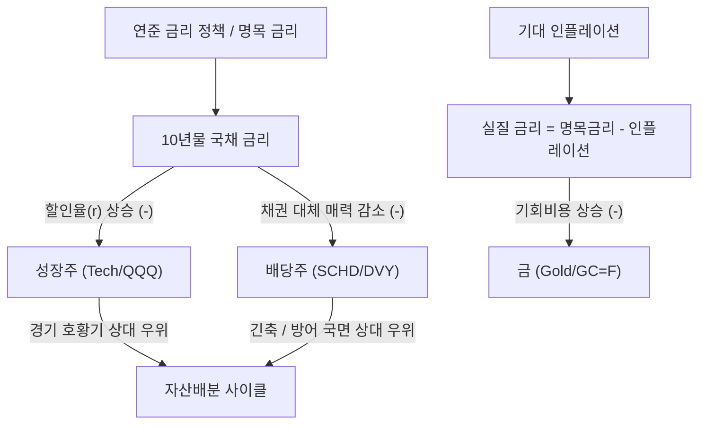
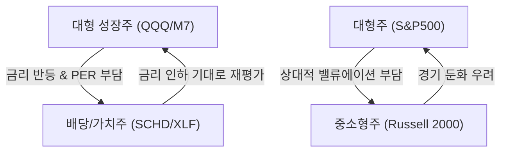
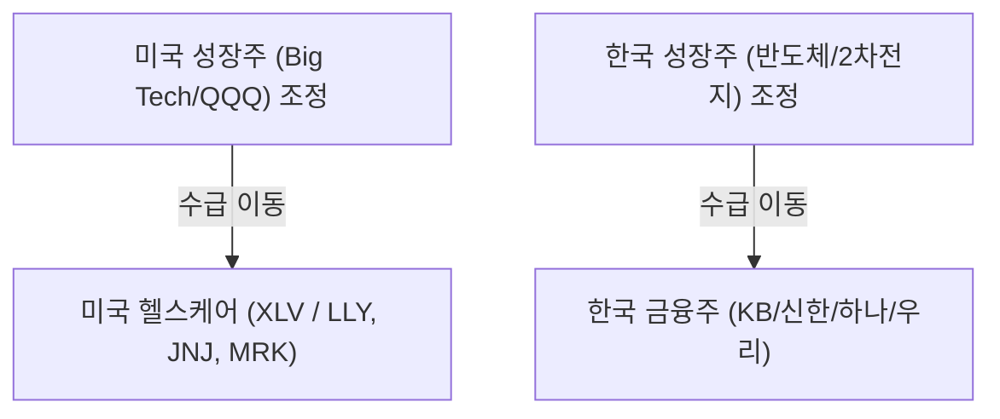
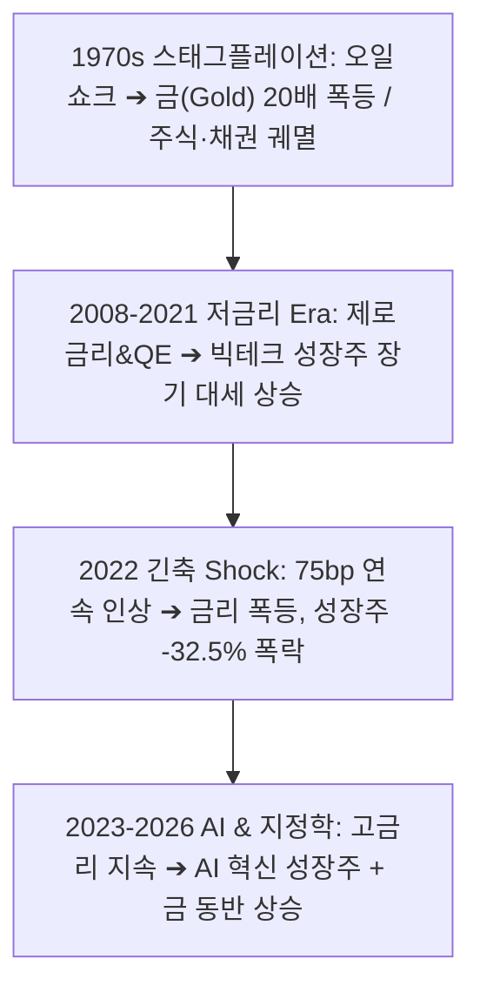
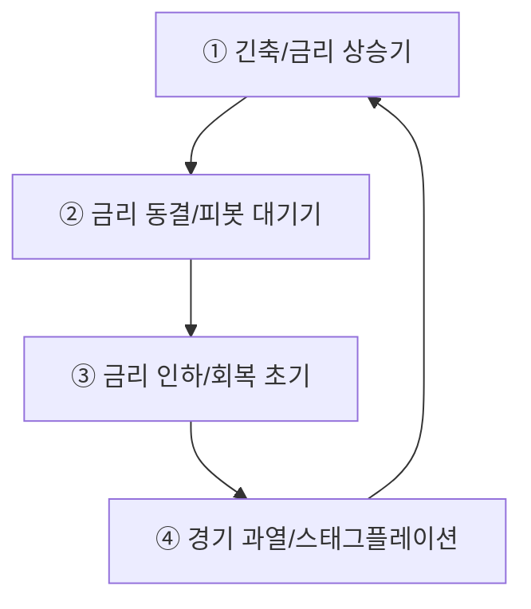

# 자산 시장 메커니즘 분석: 금, 채권 금리, 성장주, 배당주의 역학관계와 과거 데이터 검증

**작성일자:** 2026년 10월 9일  
**분석 주체:** Claude (`[C]`)  
**분류:** 미국 및 글로벌 매크로 자산배분 전략 리포트  

---

## Executive Summary

글로벌 자산 시장은 **금리(할인율 및 실질 금리)**, **인플레이션**, **경기 성장성(Growth)**이라는 3대 거시 경제 축을 중심으로 역동적인 톱니바퀴처럼 물려 움직입니다.

1. **채권 금리(할인율) ↔ 성장주:** 채권 금리는 자산 시장의 '할인율(Discount Rate)' 역할을 합니다. 듀레이션(Duration)이 긴 성장주는 금리 상승기 현금흐름의 현재가치(PV) 할인 폭이 커져 가장 큰 밸류에이션 타격을 받습니다.
2. **실질 금리(Real Yield) ↔ 금(Gold):** 금은 이자를 지급하지 않는 자산(Zero Yield Asset)이므로, 명목 금리에서 기대인플레이션을 뺀 **실질 금리(r_real = r_nom - 기대인플레이션)**와 명확한 **음(-)의 상관관계**를 갖습니다. 실질 금리가 상승하면 금 보유의 기회비용이 커져 금 가격이 압박을 받습니다.
3. **채권 금리 ↔ 배당주:** 배당주는 주식 시장 내에서 '채권 대체재(Bond Proxy)' 역할을 합니다. 무위험 국채 금리가 상승하면 배당 수익률의 상대적 매력도가 떨어져 자금 이탈이 발생합니다.
4. **성장주 ↔ 배당주:** 경기 확장 및 금리 하락기에는 성장주가 압도하고, 경기 둔화 및 금리 상승(긴축)기에는 안정적인 현금흐름을 창출하는 배당주가 방어력을 발휘합니다.

---

## 1. 자산군 간 역학관계 4대 핵심 축 (Theoretical Framework)



### ① 채권 금리 vs 성장주 (DCF 가치평가 메커니즘)

주식의 가치는 미래에 창출할 현금흐름(Cash Flow)을 현재가치로 할인한 합계입니다.

$$ PV = \sum_{t=1}^{n} \frac{CF_t}{(1 + r)^t} $$

* **할인율(r)**은 `무위험 지표 금리(국채 금리) + 주식 위험 프리미엄(ERP)`으로 구성됩니다.
* **성장주(Growth Stocks):** 당장의 이익보다는 먼 미래(5년~10년 후)에 막대한 현금흐름이 집중되어 있어 **듀레이션(Duration)**이 매우 깁니다. 따라서 분모의 할인율 **r**이 소폭만 상승해도 현재가치 **PV**가 폭락합니다.
* **배당주/가치주(Dividend/Value Stocks):** 현재 시점에 안정적인 배당과 현금을 지급하므로 듀레이션이 짧아 금리 상승 충격에 상대적으로 강한 면모를 보입니다.

---

### ② 실질 금리(Real Yield) vs 금(Gold)

금은 인플레이션 헤지 자산인 동시에, 이자나 배당을 주지 않는 자산입니다. 따라서 금의 가치를 결정하는 핵심 변수는 **실질 금리(Real Interest Rate)**입니다.

> **실질 금리 (Real Yield) = 명목 국채 금리 (Nominal Yield) - 기대 인플레이션 (Expected Inflation)**

* **실질 금리 > 0 (상승 국면):** 은행 예금이나 국채에 돈을 맡겨도 인플레이션을 훌쩍 넘는 실질 수익을 얻을 수 있으므로, 이자를 주지 않는 금을 보유할 이유(기회비용)가 줄어들어 **금 가격 하락** 압력이 작용합니다.
* **실질 금리 < 0 (하락/음수 국면):** 인플레이션이 명목 금리보다 높으면 화폐의 실질 가치가 하락하므로, 실물 자산이자 안전 자산인 **금 가격이 폭등**합니다.

---

### ③ 채권 금리 vs 배당주 (채권 대체재 및 스프레드 역학)

배당주는 안정적인 현금 흐름을 제공하므로 투자자들에게 국채의 대안으로 고려됩니다.

> **Dividend Yield Spread = 배당주 배당수익률 - 미국 10년물 국채 금리**

* **국채 금리 low (저금리 시대):** 10년물 국채 금리가 1~2%대일 때, 배당수익률 3.5~4%를 주는 배당주(SCHD 등)는 강력한 자금 유입을 경험합니다.
* **국채 금리 high (고금리 시대):** 무위험 10년물 국채 금리가 4.5~5.0%에 달하면, 원금 손실 위험을 무릅쓰고 3.5% 배당주를 보유할 유인이 급격히 감소(스프레드 역전)하여 배당주 가격 하락 압력으로 작용합니다.

---

## 2. 매크로 국면별 자산 배분 4분면 매트릭스

경기 성장(Growth)과 물가(Inflation)의 축에 따라 4가지 국면으로 구분되며, 각 국면별 최적 주도 자산이 달라집니다.

| 매크로 국면 | 경제 상황 조건 | 주도 자산 (Outperform) | 열위 자산 (Underperform) | 핵심 역학관계 메커니즘 |
| :--- | :--- | :--- | :--- | :--- |
| **① Goldilocks (골디락스)** | 고성장 + 저물가 (금리 안정) | **성장주 (QQQ)** | 금, 에너지 원자재 | 실질 금리 안정 + 기업 이익 급증 → 성장주 밸류에이션 리레이팅 |
| **② Reflation (리플레이션)** | 고성장 + 고물가 (금리 상승) | **원자재, 가치주, 성장주** | 장기 국채 | 경기가 좋아 금리 상승 충격을 기업 실적 성장이 상쇄 |
| **③ Stagflation (스태그플레이션)** | 저성장 + 고물가 (금리 급등) | **금(Gold), 원자재, 현금** | **성장주, 배당주, 채권** | 실질 소득 감소 + 고금리 할인율 압박 → 주식/채권 동반 폭락 |
| **④ Deflation / Recession** | 저성장 + 저물가 (금리 급락) | **미국 장기채(TLT), 금** | 성장주, 원자재 | 연준의 전방위 금리 인하 → 채권 가격 폭등 및 안전자산 쏠림 |

---

## 3. 자산 및 섹터 순환매 장세(Sector & Asset Rotation)의 역학관계

순환매(Rotation)란 증시 내 유동성이 제한된 상태에서 자금이 특정 자산군이나 섹터에 멈춰있지 않고, **금리·경기 국면·밸류에이션 부담**에 따라 톱니바퀴처럼 순차적으로 이동하는 현상입니다.

### ① 3대 주요 순환매 사이클 패턴 (Rotation Patterns)



### ② 순환매를 촉발하는 3대 핵심 트리거 (Triggers)

1. **금리 및 수익률 곡선(Yield Curve)의 변화:**
   * **수익률 곡선 스티프닝(Steepening):** 장기 금리가 오르고 경기 회복 기대가 커지면 **금융/배당/가치주**로 순환매 자금 유입.
   * **수익률 곡선 플래트닝(Flattening) & 금리 인하:** 성장 기대가 둔화되거나 둔화 극복을 위한 금리 인하 전환 시 **고성장주 및 중소형주(IWM)**로 순환매.
2. **밸류에이션 프리미엄 갭 (Valuation Disparity):**
   * 대형 성장주(M7 등)의 PER이 과거 평균 상단에 도달하여 밸류에이션 부담이 커지면, 동반 성장성이 있지만 주가가 정체된 **소외 섹터(배당주, 헬스케어, 중소형주)**로 차익실현 자금이 대거 이동(Cash Out & Rotation)합니다.
3. **경기 순환 사이클 (Business Cycle Phases):**
   * **회복기:** 금융, 자유소비재, IT (성장주 주도)
   * **확장기:** 산업재, 소재, 테크 (성장 및 민감주)
   * **후퇴기:** 에너지, 원자재 (인플레이션 수혜주)
   * **수축기:** 필수소비재, 헬스케어, 유틸리티 (고배당 방어주)

### ③ 순환매 장세 포트폴리오 대응 전략

* **바벨 전략 (Barbell Strategy):** 포트폴리오의 한쪽 끝에는 **핵심 AI/기술 성장주(QQQ)**, 다른 한쪽 끝에는 **고배당/안정주(SCHD)**를 동시 보유하여 어떤 순환매가 발생하더라도 쏠림 위험을 방지합니다.
* **상대 강도(RSI / Relative Strength) 스크리닝:** 과열된 자산군(RSI > 70)에서 일부 차익을 실현하고, 순환매 대기선에 있는 눌림목/소외 자산군(RSI < 40)으로 사전 분할 배치하는 정량적 리밸런싱을 시행합니다.

---

### ④ [한미 시장 비교] 성장주 조정 시 피난처 순환매의 구조적 차이

성장주(Big Tech / 반도체)가 조정을 받을 때, 미국 시장과 한국 시장에서 자금이 흘러 들어가는 **방어적 피난처(Safe Haven) 섹터의 차이**가 명확히 존재합니다.



| 구분 | 미국 증시 (US Market) | 한국 증시 (Korea Market) |
| :--- | :--- | :--- |
| **성장주 조정 시 수급 피난처** | **헬스케어 섹터 (Health Care / XLV)** | **금융주 / 은행지주 (Financials)** |
| **주요 대표 종목** | 일라이 릴리(LLY), 존슨앤드존슨(JNJ), 머크(MRK) | KB금융, 신한지주, 하나금융지주, 삼성화재 |
| **헬스케어 섹터의 성격** | **경기 비순환 방어주:** 경기가 나빠도 약품 소비는 비탄력적이며 막대한 현금흐름과 배당 창출 | **고위험 임상 성장주:** R&D 중심 적자 기업이 많아 고금리/긴축 시 주가 할인 타격 |
| **금융주 섹터의 성격** | **경기 민감주:** 경기 침체 시 대손충당금 증가 및 신용 리스크 우려로 단순 방어주가 아님 | **국내 최강 고배당/밸류업 방어주:** 저PBR(0.3~0.5배), 6~8% 고배당, 주주환원 확대로 안전지대 인식 |
| **금리 상승기 반응** | 헬스케어 실적 영향 적음, 방어력 유지 | NIM(순이자마진) 개선 기대로 성장주 하락 충격을 직접 수혜로 상쇄 |

---

## 4. 과거 역사적 데이터 검증 및 사례 분석 (Historical Case Studies)



### [사례 1] 1970년대 스태그플레이션 (1973~1980)
* **배경:** 1차·2차 석유파동으로 물가가 14%까지 치솟고 폤더널 볼커 연준 의장이 기준금리를 20%까지 올린 시기.
* **역학관계 작동:**
  * 명목/실질 금리 폭등으로 인해 **주식 시장은 10년간 장기 박스권 하락(Lost Decade)**.
  * 인플레이션 헤지 및 화폐가치 하락 위험으로 **금(Gold) 가격은 1970년 온스당 $35에서 1980년 $850까지 약 24배(2,300%) 폭등**.

### [사례 2] 2022년 연준의 고강도 긴축 Shock
* **배경:** 코로나19 풀린 유동성과 공급망 병목으로 인플레이션이 9.1%까지 치솟자 연준이 4차례 연속 75bp 인상 등 역사상 가장 가파른 금리 인상 단행.

```
[2022년 자산군별 변동 폭]
- 미국 10년물 국채 금리: 1.51% ───( +156.5% 급등 )───> 3.88%
- 기술 성장주 (QQQ):     $397 ────( -32.58% 폭락 )───> $266
- 배당 안정주 (SCHD):    $80.8 ───( -3.26% 선방 )────> $75.6
- 금 선물 (GC=F):        $1,828 ──( -0.13% 방어 )────> $1,826
```

* **역학 검증:** 
  * 10년물 국채 금리가 급등하자 듀레이션이 긴 **나스닥/성장주(QQQ)가 -32.58% 폭락**.
  * 반면 현금흐름이 견고하고 배당을 주는 **배당주(SCHD)는 -3.26%**에 그쳐 압도적인 방어력을 증명.

### [사례 3] 2023년~2026년 최근 데이터 실증 분석 (2020~2026 empirical Data)

최근 2020년부터 2026년 현재까지의 일간 수익률 및 연도별 수익률 실증 데이터 분석 결과입니다.

#### ① 자산군 간 일간 수익률 상관계수 (2020~2026)

| 자산군 | 금 (Gold) | 미국 10년물 금리 (US10Y) | 성장주 (QQQ) | 배당주 (SCHD) | S&P500 (SPY) |
| :--- | :---: | :---: | :---: | :---: | :---: |
| **금 (Gold)** | **1.000** | **-0.186** | 0.131 | 0.085 | 0.121 |
| **미국 10년물 금리 (US10Y)** | **-0.186** | **1.000** | 0.143 | **0.302** | 0.227 |
| **성장주 (QQQ)** | 0.131 | 0.143 | **1.000** | **0.651** | **0.934** |
| **배당주 (SCHD)** | 0.085 | **0.302** | **0.651** | **1.000** | **0.842** |
| **S&P500 (SPY)** | 0.121 | 0.227 | **0.934** | **0.842** | **1.000** |

* **해설:**
  * **금과 10년물 금리(-0.186):** 분명한 **음(-)의 상관관계**를 보여, 금리가 상승할 때 금 가격이 압박을 받는 뚜렷한 기회비용 역학이 입증됩니다.
  * **배당주와 금리(+0.302):** 배당주는 금리 상승(경기 회복/가치주 로테이션) 국면에서 성장주보다 금리 동향에 긍정적으로 반응하는 가치주적 특성을 공유합니다.

#### ② 연도별 주요 자산군 수익률 비교 (%)

| 연도 | 금 (Gold) | 10년물 금리 변동률 | 성장주 (QQQ) | 배당주 (SCHD) | S&P 500 (SPY) | 주요 매크로 환경 및 자산 역학 특징 |
| :---: | :---: | :---: | :---: | :---: | :---: | :--- |
| **2021** | -3.51% | **+64.89%** | +27.42% | **+29.88%** | +28.73% | 코로나 리오프닝, 금리 상승 속에 가치/배당주(+29.88%) 강세 |
| **2022** | **-0.13%** | **+156.55%** | **-32.58%** | **-3.26%** | -18.18% | 연준의 텐트러스 긴축. 금리 폭등으로 성장주 궤멸, 배당주/금 선방 |
| **2023** | +13.45% | -0.34% | **+54.86%** | +4.54% | +26.18% | 금리 상승 멈춤 + Big Tech/AI 열풍으로 성장주(+54.8%) 대폭등 |
| **2024** | **+27.47%** | +18.29% | +25.58% | +11.66% | +24.89% | AI 실적 확인 + 중앙은행(BRICS) 금 매수세 확대로 성장주/금 동반 상승 |
| **2025** | **+64.37%** | -8.97% | +20.77% | +4.34% | +17.72% | 탈달러화 및 실질금리 인하 기대로 **금(+64.37%) 기록적 대폭등** |
| **2026** | -3.56% | +27.14% | **+20.83%** | **+21.51%** | +12.71% | 금리 반등 속 성장주와 배당주가 함께 실적 기반 견조한 흐름 유지 |

---

## 5. 최종 투자 시사점 및 전략 가이드 (Actionable Takeaways)

1. **금리 피봇(Inflexion Point) 포착 시:**
   * 연준의 금리 인하 서클 진입 시 **성장주(QQQ)** 및 **미국 장기채(TLT)**를 포트폴리오의 핵심 공격 자산으로 배치해야 합니다.
2. **인플레이션 둔화 속 고금리 유지(High for Longer) 국면 시:**
   * 무위험 국채 금리가 높은 구간에서는 현금 흐름이 확실한 **배당주(SCHD)** 및 밸류체인 가치주로 포트폴리오 듀레이션을 줄여 방어력을 높여야 합니다.
3. **지정학적 리스크 & 탈달러화(De-Dollarization) 시대의 금(Gold):**
   * 전통적으로 금은 실질금리와 반대로 움직이지만, 최근(2024~2026)에는 **중앙은행의 탈달러화 적립 수요**가 실질금리 압박을 이겨내고 시세를 견인하는 변형 역학이 발생하고 있으므로 포트폴리오 내 5~10% 필수 헤지 자산으로 유지하는 것이 유효합니다.

---

## 6. 매크로 사이클 국면/시점별 구체적 투자 액션 플랜 (Tactical Asset Allocation Framework)

매크로 환경의 변화 시점(Pivot & Transition)에 따라 투자자가 실행해야 하는 **자산군별 세부 비중 조절 및 매수/매도 실행 가이드**입니다.



### ① 금리 인상 초입 ~ 긴축 진행 국면 (Tightening Phase)
* **매크로 특징:** 인플레이션 급등, 연준 기준금리 인상, 10년물 국채 금리 급등.
* **투자 행동 지침 (Action Plan):**
  * **주식:** 듀레이션이 긴 **고PER 성장주(Tech) 비중을 과감히 축소**하고, **고배당주(SCHD), 한국/미국 금융주(XLF), 에너지 섹터**로 자금을 이동(가치주 로테이션).
  * **채권:** 채권 가격 폭락을 피하기 위해 장기채를 매도하고 **단기채/현금성 ETF(SGOV, SHV, BIL)**로 듀레이션을 최소화.
  * **대체자산:** 원자재(DBC) 및 금 일부 보유.
  * **추천 자산배분 비중:** `가치/배당주 35%` | `단기채/현금 45%` | `원자재/금 15%` | `성장주 5%`

### ② 금리 동결 ~ 인하 피봇 대기 국면 (Pausing & Pre-Pivot Phase)
* **매크로 특징:** 금리 인상 중단, 물가 피크아웃 징후, 경기 둔화 우려 대두.
* **투자 행동 지침 (Action Plan):**
  * **주식:** 밸류에이션이 충분히 하락한 **품질 빅테크 성장주(M7/QQQ)** 및 **헬스케어(XLV)**를 분할 매수.
  * **채권:** 단기채에서 **미국 장기 국채(TLT, EDV)**로 선제적 자금 이동 (향후 금리 인하 시 자본차익 Maximize).
  * **대체자산:** 실질금리 하락 반전을 겨냥해 **금(Gold)** 비중 확대.
  * **추천 자산배분 비중:** `미국 장기채 35%` | `빅테크 성장주 35%` | `금(Gold) 15%` | `현금 15%`

### ③ 금리 인하 초입 ~ 경기 회복 초기 (Easing & Goldilocks Phase)
* **매크로 특징:** 연준의 전방위 금리 인하, 실질금리 하락, 경기 연착륙/골디락스 진입.
* **투자 행동 지침 (Action Plan):**
  * **주식:** 포트폴리오를 가장 공격적으로 전환. **고성장주(AI/반도체), 중소형주(IWM/Russell 2000)** 집중 매수.
  * **채권:** 금리 인하 진행에 따른 장기채 자본차익을 일부 실현하고 중기채/투자등급 회사채로 이동.
  * **대체자산:** 위험자산 선호(Risk-On) 극대화로 금 비중 소폭 축소, 주식 비중 최대화.
  * **추천 자산배분 비중:** `성장주/중소형주 65%` | `중/장기채 20%` | `배당주 10%` | `현금/금 5%`

### ④ 경기 과열 ~ 스태그플레이션 경고 국면 (Late Cycle & Stagflation Risk)
* **매크로 특징:** 경기 둔화 속 물가 재발, 실질 소득 감소, 주식/채권 동반 침체 위험.
* **투자 행동 지침 (Action Plan):**
  * **주식:** 주식 비중을 전체적으로 줄이고 **필수소비재(XLP), 헬스케어(XLV), 한국 금융주** 등 방어주로만 제한.
  * **채권:** **물가연동채(TIPS)** 및 단기 채권 배치.
  * **대체자산:** **금(Gold) 및 실물 원자재 비중을 최고 수준(20~25%)으로 확대**하여 화폐가치 하락에 대비.
  * **추천 자산배분 비중:** `방어주 30%` | `금/원자재 25%` | `물가연동채/단기채 35%` | `현금 10%`
