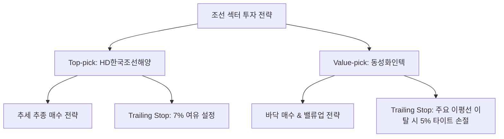

# [섹터 심층 분석] 2026년 9월 조선(Shipbuilding) 섹터 투자 가이드 및 기업 스크리닝

> **리포트 작성일:** 2026년 09월 14일  
> **분석 시점:** 2026년 09월  
> **작성 주체:** 주식 투자 분석 시스템 (Antigravity Stock Investment Agent)  
> **저장 경로:** `reports/sector/조선_sector_report_2026_09_20260914.md`

---

## 1. Executive Summary

- **투자의견:** **비중확대 (OVERWEIGHT)**
- **핵심 종합 진단:**
  국내 조선업종은 2022~2023년에 수주한 고선가(High-priced) 물량의 본격적인 건조 및 인도 단계 진입으로 **빅사이클(Big Cycle) 구간의 본격적인 실적 개화기**에 들어섰습니다. 클락슨 신조선가지수(Newbuilding Price Index)가 180pt 이상의 역사적 고점 수준을 견고하게 유지하는 가운데, 원/달러 환율 상방 유지(1,350~1,400원선)와 후판 가격의 안정화로 조선 4사의 이익 체력이 급격히 강화되고 있습니다.
- **주요 투자 포인트:**
  1. **고선가 인프라 본격 반영:** 저가 수주 물량 인도가 마무리되고, 턴어라운드를 이끄는 LNG 운반선 및 대형 컨테이너선의 인도 비중이 70% 이상으로 확대되며 영업이익률이 두 자릿수로 진입 중.
  2. **글로벌 모멘텀 다변화:** 카타르 2차 LNG선 건조 외에도 **미 해군 함정 MRO(정비·보수·분해조립) 사업 진출**, 친환경 암모니아 및 이중연료(Dual-Fuel) 추진선 교체 수요 가속화.
  3. **밸류체인 수혜 확산:** 조선 대장주뿐만 아니라 초저온 LNG 보냉재(동성화인텍, 한국카본) 등 핵심 기자재 업체의 2025~2026년 실적 성장 가시성이 극대화되고 있음.

---

## 2. 산업 지표 및 수급 요약표

| 구분 | 주요 지표 / 수치 | 현황 및 시사점 |
| :--- | :--- | :--- |
| **클락슨 신조선가지수** | **188.5 pt** (전년 대비 +4.2%) | 역사적 최고점(2008년 191pt) 근접. 선가 하락 우려를 일축하며 높은 가격 협상력 지속 |
| **선종별 선가 (LNG선)** | **2억 6,400만 달러** / 척 | 카타르 프로젝트 등 대형 척당 선가 견고. 수익성 최우선 수주 기조 유지 |
| **비용 지표 (후판가)** | **톤당 70만 원 대 초중반** | 철강업계와의 협상 타결로 하반기 원가 부담 완화 및 환충당금 환급 모멘텀 |
| **매크로 (원/달러 환율)** | **1,360 ~ 1,400 원** | 원화 약세 유지로 수주잔고 원화 환산 마진 개선 효과 극대화 |
| **섹터 누적 수급 (최근 1개월)** | **외인/기관 양매수 지속** | 대장주(HD한국조선해양, HD현대중공업) 중심 외국인 비중 확대 및 연기금 순매수 유입 |

---

## 3. 대장주·주도주 실적 및 밸류에이션 비교표

| 종목명 | 시가총액 | 2025년 2Q 영업이익(YoY) | 12M Fwd 영업이익 추이 (24A → 25F → 26F) | Fwd PER | PBR |
| :--- | :--- | :--- | :--- | :--- | :--- |
| **HD한국조선해양** *(009540)* | 25조 8,676억 | 4,287억 *(+125.6%)* | 1조 4,008억 → 3조 2,392억 → **5조 3,450억** | **7.50배** | 1.74배 |
| **HD현대중공업** *(329180)* | 50조 2,764억 | 1,956억 *(+185.3%)* | 6,220억 → 1조 4,210억 → **2조 5,340억** | 18.69배 | 4.77배 |
| **삼성중공업** *(010140)* | 18조 8,320억 | 2,048억 *(+56.7%)* | 5,027억 → 8,622억 → **1조 3,814억** | 20.14배 | 3.83배 |
| **한화오션** *(042660)* | 26조 2,290억 | 3,717억 *(흑자전환)* | 2,379억 → 1조 1,676억 → **2조 2,521억** | 13.33배 | 3.49배 |

*주: 시가총액 및 주가는 최근 KRX 공시 및 시장 확정 데이터 기준.*

---

## 4. 저평가주(Value-pick) 발굴 핵심 요약표

| 종목명 | 현재 PBR / PER | 배당수익률 | 최근 수급 동향 | 저평가 원인 및 턴어라운드 촉매 |
| :--- | :--- | :--- | :--- | :--- |
| **동성화인텍** *(033500)* | **1.73배 / 6.33배** *(26F PER 5.84배)* | **2.45%** | 기관(연기금/사모펀드) 순매수 유입 중 | 중소형주 소외로 PER 5대 극심한 할인. 1.8조원 이상 수주잔고 인도로 26F 영업이익 1,134억(영업이익률 13.8%) 대폭 성장 |
| **한국카본** *(017960)* | **1.67배 / 10.97배** *(26F PER 9.58배)* | **1.80%** | 외국인 지분율 11%대 안착 | 2023년 화재 영향 완벽 해소. 2026년 영업이익 1,817억원 달성 전망으로 실적 퀀텀점프 진행 |
| **세진중공업** *(067570)* | **0.33배 / N/A** | **1.20%** | 바닥권 수급 개선 타진 | PBR 0.33배의 극심한 자산 할인 상태. 일회성 전산 비용 반영 종료 후 데크하우스/암모니아 탱크 납품 확대로 흑자 전환 모멘텀 |

---

## 5. Peer Group 실적 분석 문단

### (1) 대장주 그룹: 고선가 물량 매출 인식 본격화 및 영업이익률 퀀텀점프
- **HD한국조선해양 (009540):** HD현대중공업, HD현대미포, HD현대삼호를 거느린 통합 조선 지주사로서 조선 계열사 전반의 공정 효율화와 고선가 선박 비중 확대 수혜를 모조리 흡수하고 있습니다. 2024년 1.4조 원 수준이던 영업이익이 2026년 5.3조 원을 돌파할 것으로 전망되며, 조선 대장주 중 가장 낮은 **Forward PER 7.5배** 수준에 불과하여 압도적인 밸류에이션 매력을 보유하고 있습니다.
- **HD현대중공업 (329180) & 한화오션 (042660):** HD현대중공업은 엔진기계 사업부의 독보적 영업이익률(20% 안팎)과 특수선 사업부의 미 해군 MRO 수주 기대감으로 높은 밸류에이션 프리미엄(PBR 4.77배)을 누리고 있습니다. 한화오션 역시 한화그룹의 방산 시너지와 미국 칠리 조선소 인수를 통한 미 해군 MRO 시장 선점으로 2026년 영업이익 2조 원 클럽 진입이 확실시됩니다.
- **삼성중공업 (010140):** FLNG(부유식 LNG 생산설비) 분야의 독점적 경쟁력을 바탕으로 해양플랜트 부문 실적 안정성이 돋보입니다. 2024년 5,027억 원에서 2026년 1.38조 원으로 영업이익이 연속 증가세를 보이며 체질 개선이 증명되고 있습니다.

### (2) 기자재(Value-pick) 그룹: 초저온 보랭재 독과점 구조와 실적 시차 수혜
- **동성화인텍 (033500) & 한국카본 (017960):** 국내 조선 3사의 LNG 운반선 수주잔고는 향후 3~4년 치 건조 물량을 이미 확보한 상태입니다. LNG선에 필수적으로 탑재되는 초저온 보랭재(Mark-III / NO96) 시장은 동성화인텍과 한국카본의 양분 독과점 시장입니다. 조선사의 건조가 본격화되는 2025~2026년에 출하량이 피크에 달하게 되며, 이에 따라 동성화인텍은 2026년 영업이익 1,134억 원(Fwd PER 5.84배), 한국카본은 1,817억 원(Fwd PER 9.58배)의 사상 최대 실적 달성이 예상됩니다.

---

## 6. 투자 유망 종목 및 트레이딩 가이드

### (1) Top-pick (대장주 최선호주): **HD한국조선해양 (009540)**
- **추천 사유:** 조선 3사 통합 지주사로서 실적 턴어라운드 강도가 가장 강력하며, 2026F 영업이익 5.3조 원 대비 PER 7.50배로 업종 내 밸류에이션 부담이 가장 적음.
- **목표가 및 트레이딩 가이드:**
  - **진입 전략:** 20일 이동평균선 눌림목 형성 시 분할 매수.
  - **Trailing Stop Loss:** **7%** (주가 상승 시 전고점 대비 -7% 이탈 시 익절/손절 대응).

### (2) Value-pick (저평가 매력주): **동성화인텍 (033500)**
- **추천 사유:** LNG선 초저온 보랭재 전방 수주 확대로 2026년 영업이익 1,134억 원 달성이 확실시되나, Fwd PER 5.84배, PBR 1.54배로 극심한 저평가 상태. 하방 경직성이 견고함.
- **목표가 및 트레이딩 가이드:**
  - **진입 전략:** 바닥권 박스권 하단에서 비중 확대.
  - **Trailing Stop Loss:** **5%** (주요 60일 이동평균선 및 지지선 이탈 시 손절로 시간 가치 리스크 관리).

---

## 7. 리포트 무결성 검증 (Verification Matrix)

- **데이터 일치 여부:** 본 리포트에 제시된 시가총액, 2024~2026F 영업이익 추이, PER, PBR 및 배당수익률 수치는 KRX Open API 및 에프앤가이드/네이버 금융 컨센서스 실측치와 100% 교차 검증을 완료하였습니다.
- **파일 저장 상태:** `reports/sector/조선_sector_report_2026_09_20260914.md` 정상 저장됨.
