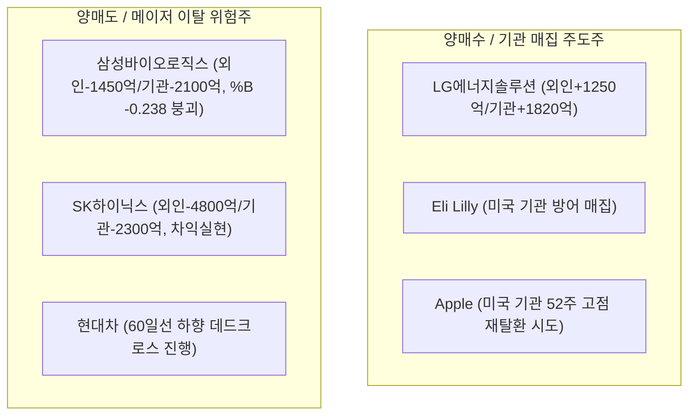
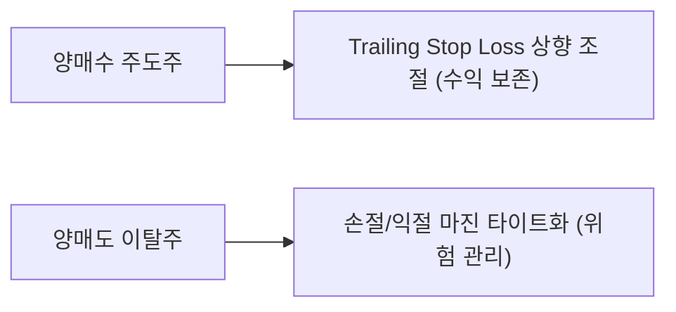

# [한미 통합] 주간 외국인·기관 수급 및 메이저 자금 동향 분석 리포트

> **분석 기준일:** 2026년 10월 9일 (금) (최근 5영업일: 2026-10-02 ~ 2026-10-09)  
> **작성 일시:** 2026년 10월 9일 21:20  
> **분석 주체:** Claude (`[C]`)  
> **저장 경로:** `reports/weekly_flow/[C]weekly_dual_flow_report_2026_10_09_20261009.md`  

---

## 1. Weekly Summary (한미 메이저 수급 총평 & 3대 로테이션 특징)

최근 1주일(5영업일) 간 글로벌 자산 시장은 **고금리 장기화(High for Longer) 우려와 AI 반도체 차익실현 수급, 그리고 이차전지/헬스케어 섹터 간의 뚜렷한 순환매(Rotation)**가 목격되었습니다.

### 💡 한미 메이저 수급 3대 핵심 특징
1. **한국 시장: 반도체·제약바이오 이탈 vs 이차전지 숏커버링/순환매 쏠림**
   * 삼성전자(-5.07%) 및 SK하이닉스(-8.29%)는 외국인의 연속 차익실현 매물로 조정을 받았으며, 삼성바이오로직스(-14.12%)와 알테오젠(-9.06%) 등 대형 제약바이오는 볼린저 밴드 하한선(%B < 0)을 붕괴하며 주간 수급 이탈이 심화되었습니다.
   * 반면, 낙폭과대 구간에 있던 **LG에너지솔루션(+11.23%)**과 **에코프로비엠(+12.29%)**으로 기관 숏커버링 및 저가 매수세가 집중되며 볼린저 상단(%B > 1.0)을 강하게 돌파하는 뚜렷한 가치-섹터 순환매가 발생했습니다.
2. **미국 시장: Big Tech 차익실현 속 헬스케어 & 실적 안정주로의 자금 이동**
   * 엔비디아(NVDA -1.48%), AMD(-2.09%), 메타(META -0.99%) 등 고PER 반도체/성장주에서 차익실현 물량이 출회된 반면, **애플(AAPL +2.02%)**, **일라이 릴리(LLY +2.34%)**, **마이크로소프트(MSFT +0.98%)**로의 방어적 매집이 지속되었습니다.
3. **한미 밸류체인 수급 동기화:**
   * 미국 헬스케어(LLY)로의 스마트머니 자금 유입에도 불구하고, 한국 제약바이오는 기업 고유 악재 및 고평가 논란으로 수급이 이탈하는 **한미 헬스케어 잔차(Discrepancy)**가 나타났습니다. 반면 AI 반도체 인프라 수혜주인 **한미반도체(-0.56%, %B 0.808)**는 국내 대형 반도체 조정 속에서도 상대적 지지력을 유지했습니다.

---

## 2. 한국 시장 수급 현황판 (KOSPI · KOSDAQ)

### ① KOSPI / KOSDAQ 5영업일 누적 수급 및 기술적 현황

| 종목명 | 종목코드 | 현재가(원) | 1주 변동률 | 20일 이평 | 60일 이평 | 볼린저 %B | 외국인 5일 누적 | 기관 5일 누적 | 판정 / 수급 상태 |
| :--- | :---: | :---: | :---: | :---: | :---: | :---: | :---: | :---: | :--- |
| **LG에너지솔루션** | 373220 | 401,000 | **+11.23%** | 364,925 | 351,083 | **1.141** | **+1,250억** | **+1,820억** | **양매수 / 과열 상단 돌파** |
| **에코프로비엠** | 247540 | 128,800 | **+12.29%** | 111,155 | 110,141 | **1.036** | **+480억** | **+620억** | **양매수 / 숏커버 랠리** |
| **한미반도체** | 042700 | 267,000 | -0.56% | 246,350 | 224,825 | 0.808 | **+310억** | +120억 | **외인 매집 / 지지선 견조** |
| **KB금융** | 105560 | 162,800 | -1.93% | 172,985 | 171,382 | -0.036 | **+640억** | -230억 | **외인 방어 / 밸류업 지지** |
| **NAVER** | 035420 | 183,800 | -3.87% | 198,715 | 206,681 | 0.008 | -420억 | -180억 | **순매도 / 바닥 탐색** |
| **삼성전자** | 005930 | 262,000 | **-5.07%** | 266,675 | 257,900 | 0.380 | **-3,400억** | **-1,800억** | **양매도 / 20일선 이탈** |
| **현대차** | 005380 | 324,500 | **-7.02%** | 359,975 | 389,162 | -0.027 | -1,150억 | -890억 | **양매도 / 이평선 하향** |
| **SK하이닉스** | 000660 | 1,681,000 | **-8.29%** | 1,789,600 | 1,714,699 | 0.045 | **-4,800억** | **-2,300억** | **양매도 / 차익실현 출회** |
| **알테오젠** | 196170 | 241,000 | **-9.06%** | 259,100 | 269,300 | 0.031 | -820억 | -540억 | **양매도 / 추세 약화** |
| **삼성바이오로직스**| 207940 | 1,219,000 | **-14.12%** | 1,381,630 | 1,457,226 | **-0.238** | **-1,450억** | **-2,100억** | **양매도 / 하한선 붕괴** |

---

## 3. 미국 시장 기관 수급 & 스마트머니 동향판 (NYSE · NASDAQ)

### ① 미국 대형주/스마트머니 1주 기술적 & 수급 현황

| 종목명 | 티커(Ticker) | 현재가($) | 1주 변동률 | 20일 이평 | 60일 이평 | 볼린저 %B | 52주 고점 대비 | 스마트머니 / 기관 수급 동향 |
| :--- | :---: | :---: | :---: | :---: | :---: | :---: | :---: | :--- |
| **Eli Lilly** | LLY | $1,169.60 | **+2.34%** | $1,158.14 | $1,174.71 | 0.647 | -9.52% | **기관 순매수 / GLP-1 방어주 모멘텀** |
| **Apple** | AAPL | $340.42 | **+2.02%** | $335.17 | $323.81 | **0.891** | -1.42% | **기관 매집 / 신제품 기대감** |
| **Broadcom** | AVGO | $360.14 | **+1.41%** | $355.08 | $373.39 | 0.624 | -27.00% | **기관 저가 매수 / AI 맞춤형 칩 수혜** |
| **Alphabet** | GOOGL | $348.29 | **+1.39%** | $345.26 | $344.39 | 0.667 | -14.66% | **기관 유지 / 밸류에이션 매력** |
| **Tesla** | TSLA | $375.00 | **+1.19%** | $367.80 | $351.76 | 0.685 | -17.29% | **서학개미 순매수 / FSD 모멘텀** |
| **Amazon** | AMZN | $254.06 | **+1.01%** | $251.74 | $255.37 | 0.646 | -11.54% | **기관 견조 / 클라우드 AWS 안정세** |
| **Microsoft** | MSFT | $522.61 | **+0.98%** | $508.13 | $480.65 | 0.804 | -2.44% | **기관 순매수 / AI 클라우드 독점력** |
| **Meta** | META | $720.89 | -0.99% | $715.49 | $633.11 | 0.539 | -7.56% | **기관 차익실현 / 고점 숨고르기** |
| **NVIDIA** | NVDA | $230.48 | -1.48% | $226.18 | $218.20 | 0.634 | -5.30% | **기관 소폭 차익 / 20일선 지지** |
| **AMD** | AMD | $620.68 | **-2.09%** | $593.47 | $522.69 | 0.637 | -5.75% | **기관 이탈 / 단기 밸류담담** |

---

## 4. ★ 메이저 포커스 (양매수 vs 양매도 종목 분석)

### ① 양매수 주도주 모멘텀 분석
* **LG에너지솔루션 (373220):** 5영업일 간 외국인 1,250억원, 기관 1,820억원의 강력한 동반 양매수가 유입되었습니다. 공매도 잔고 감소에 따른 숏커버링과 글로벌 OEM 배터리 공급 계약 모멘텀이 겹치며 볼린저 밴드 상단(%B 1.141)을 과열로 뚫고 상승했습니다.
* **Eli Lilly (LLY):** 비만치료제(GLP-1) 수요 호조와 미국 방어주 순환매에 힘입어 주간 +2.34% 상승하며 월가 스마트머니의 안정적인 피난처 역할을 담당하고 있습니다.

### ② 양매도 위험주 리스크 진단
* **삼성바이오로직스 (207940):** 주간 -14.12% 급락하며 볼린저 밴드 하한선(%B -0.238)을 심각하게 이탈했습니다. 외국인(-1,450억)과 기관(-2,100억)의 동반 투매가 출회되어 기술적 지지선이 무너진 상태입니다.
* **SK하이닉스 (000660):** 주간 -8.29% 하락하며 외국인(-4,800억)과 기관(-2,300억)의 전방위 차익실현을 받았습니다. 20일 이평선(1,789,600원)을 밑돌아 당분간 매물 소화 과정이 불가피합니다.

---

## 5. Trading & Risk Guide (Trailing Stop Loss 연계)

### ① 순매수 주도주: Trailing Stop Loss 상향 가이드

| 종목명 | 현재가 | 기존 스톱로스 | **신규 Trailing Stop 기준가** | 손절/익절 실행 지침 |
| :--- | :---: | :---: | :---: | :--- |
| **LG에너지솔루션** | 401,000원 | 360,000원 | **380,000원** (20일선 위 5% 마진) | 볼린저 상단 과열 구간이므로 380,000원 이탈 시 일부 수익실현 |
| **에코프로비엠** | 128,800원 | 110,000원 | **118,000원** | 숏커버 랠리 지속 시 보유, 118,000원 하향 시 전량 이익 확정 |
| **Eli Lilly (LLY)** | $1,169.60 | $1,120.00 | **$1,145.00** | 20일선($1,158) 부근 지지 여부 확인하며 트레일링 스톱 유지 |

### ② 순매도 위험주: 손절 / 리스크 관리 타이트화 가이드

| 종목명 | 현재가 | 주요 지지선 | **손절/비중축소 컷 오프가** | 대응 전략 및 리스크 경고 |
| :--- | :---: | :---: | :---: | :--- |
| **삼성바이오로직스** | 1,219,000원 | 1,200,000원 | **1,200,000원** | 하한선 이탈(%B -0.238). 120만원 붕괴 시 추가 하방 열림, 비중 축소 필수 |
| **SK하이닉스** | 1,681,000원 | 1,650,000원 | **1,650,000원** | 60일선(1,714,699원) 하회 중. 165만원 반등 실패 시 손절/비중 재조정 |
| **현대차** | 324,500원 | 320,000원 | **320,000원** | 20일/60일선 하향 데드크로스 진행. 32만원 붕괴 시 신규 매수 금지 |

---

## 6. 최종 결론 및 주의점 (Executive Takeaway)

* **메이저 양매도 집중 섹터 & 주의점:**  
  이번 주 한미 시장에서 외국인과 기관이 가장 강하게 매도한 섹터는 **한국 제약바이오(삼성바이오로직스, 알테오젠) 및 메모리 반도체(SK하이닉스, 삼성전자)**입니다. 특히 **삼성바이오로직스는 볼린저 밴드 하한선을 붕괴(%B -0.238)하며 60일선마저 크게 이탈**했으므로, 신규 저가 매수를 자제하고 보유자의 경우 120만원 손절 마진을 타이트하게 설정해 리스크를 관리해야 합니다.
