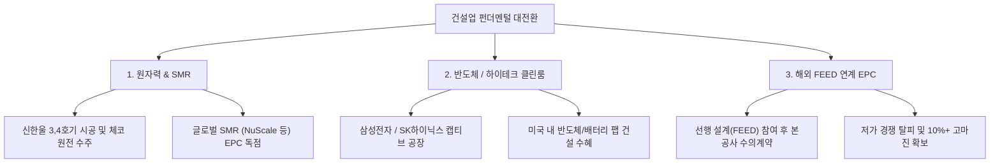

# 🎬 [김어준의 겸손은힘들다 뉴스공장 '12시에 만나요'] 주간 증시 브리핑 & 건설 섹터 심층 분석

**방송 채널:** 김어준의 겸손은힘들다 뉴스공장  
**코너명:** 12시에 만나요 (1부: 정오의 머니뉴스 / 2부: 12시 사랑방)  
**방송 일자:** 2026년 09월 28일 (월요일)  
**진행자:** 메인 MC 이광수, 박시동 경제평론가(대표), 권다영 앵커  
**출연 게스트:** 신영증권 박세라 연구원 (건설 섹터 수석 애널리스트)  
**원본 영상:** [https://www.youtube.com/watch?v=xn1oy_azv6s](https://www.youtube.com/watch?v=xn1oy_azv6s)  

---

## 1. Executive Summary

2026년 9월 28일 방송된 **김어준의 겸손은힘들다 뉴스공장 '12시에 만나요'**는 **[1부: 정오의 머니뉴스]**와 **[2부: 12시 사랑방 - 건설 섹터 심층 분석]**으로 진행되었습니다.

* **글로벌 매크로 & 정치·경제 뷰:** 미중 정상회담의 '갈등 관리(무역 휴전 2027년 1월 10일까지 연장)' 및 미-이란 대치로 유가가 93달러 선으로 재상승하고 미 10년물 국채 금리가 5.2%를 터치하며 금융 시장 부담 지속.
* **AI & 증시 이벤트:** 메타(Meta) AI 비서 '뮤즈(Muse)'의 폭발적 흥행(+36% 주가 상승)과 스마트 글래스 밸류체인 부각, 10월 1일 목요일 마이크론(Micron) 실적 발표 및 미 9월 고용보고서가 이번 주 증시의 핵심 변수.
* **건설 섹터 심층 뷰 (신영증권 박세라 연구원):** 2024년 비관론("건설만 아니면 된다")에서 **2026년 "건설 빅사이클의 시작"**으로 시각 전환. 지난 2년간 부실 현장 정리(빅배스)를 완료하고 **원자력(신한울 3·4호기, 체코 원전, SMR)**, **반도체/하이테크 공장 클린룸**, **해외 FEED 연계 EPC**로 체질 개선에 성공.

---

## 2. 1부: 정오의 머니뉴스 (이광수, 박시동, 권다영)

### 2.1 미중 정상회담 결과 복기: "갈등의 해소가 아닌 갈등의 관리"
* **핵심 내용:** 방미 일정으로 치러진 미중 정상회담은 화려한 외관 대비 실질적 딜(Deal) 타결은 없었습니다. 양국 발표에서 중국은 8가지 협력 성과를, 미국은 무역관세/에너지/투자 협력을 언급했습니다.
* **시사점:** 당초 11월 10일 예정이었던 무역 전쟁 휴전시한을 **2027년 1월 10일까지 2달 연유 유예**한 것이 실질 성과입니다. 히토류 및 AI 관련 규제 등 핵심 전략 현안은 포함되지 않은 채 확전을 막는 현상 유지 관리 수준에서 종료되었습니다.

### 2.2 이스라엘-이란 군사 긴장 & 고유가·고금리 압박
* **이란 7일 휴전안 거부:** 이란이 UN 총회 계기 미국에 7일간의 호르무즈 해협 휴전안을 제안했으나 트럼프 대통령이 거부하고 중간선거 이후 재폭격을 준비 중이라는 월스트리트저널 보도가 이어졌습니다.
* **유가 및 금리여파:** WTI 유가가 93달러 선을 위협하고, **미국 10년물 국채 금리가 5.2%를 터치**하며 시장을 압박하고 있습니다. 연준의 연내 2회 금리 인상 가능성까지 반영되며 금리 하방 경직성이 강화되었습니다.

### 2.3 메타(Meta) AI 비서 '뮤즈(Muse)' 흥행 & 하드웨어 밸류체인
* **뮤즈(Muse) 흥행 서비스:** 메타가 공개한 AI 에이전트 서비스 '뮤즈'가 출시 15일 만에 300만 다운로드를 돌파하여 챗GPT(160만) 및 제미나이(30~40만)를 압도했습니다. 이에 따라 9월 메타 주가는 +36% 폭등했습니다.
* **스마트 글래스 & 밸류체인:** 레이벤 메타 글래스, 뮤즈참(목걸이형 하드웨어) 등 웨어러블 디바이스가 공개되면서 LG이노텍, 카메라 모듈, MLCC, 기판, 투명 디스플레이 등 국내 관련 부품주의 수혜가 기대됩니다.

### 2.4 이번 주 마켓 캘린더 & 체크포인트
1. **월요일 (9/28):** BOJ 의사록 공개, 유럽 당뇨학회
2. **화요일 (9/29):** 미 JOLTS 구인건수 발표
3. **수요일 (9/30):** 미 PCE 물가지수 & 3Q GDP 수정치 발표
4. **목요일 (10/1):** **마이크론(Micron) 실적 발표 (한국시간 오전 6시)**, 한국 9월 수출입 동향, 중국 국경절 휴장 시작(~10/7)
5. **금요일 (10/2):** 미국 9월 노동부 고용보고서 발표

---

## 3. 2부: 12시 사랑방 - 건설 섹터 빅사이클 진입 심층 분석 (신영증권 박세라 연구원)

### 3.1 건설 애널리스트 10년 회고 & 시각 전환 이유
* **2024년 비관론 ("건설만 아니면 된다"):** 커버리지 10년 차 보고서에서 실적 불확실성, 무차별화, 미흡한 주주환원 3가지를 비판하며 비관론 유지.
* **2026년 반등론 ("건설 빅사이클의 시작"):** 2024~2025년에 걸쳐 주택 및 PF 부실 현장 정리를 완료하고, 저가 수주(Low-cost bidding) 경쟁 탈피 및 3대 신성장 동력을 확보하면서 펀더멘털 대전환에 진입.

### 3.2 건설업 펀더멘털을 바꾼 3대 신성장 동력

1. **원자력 발전 및 SMR (소형모듈원전):**
   * 신한울 3·4호기 시공 본격화 및 체코 원전 최종 수주에 따른 대형 원전 모멘텀.
   * 현대건설, 대우건설 등을 중심으로 글로벌 SMR 설계·시공 수주 잔고 급증.
2. **반도체 및 하이테크 공장 (Cleanroom):**
   * 단순 민간 주택을 넘어 삼성전자, SK하이닉스 및 미국 내 팹(Fab) 인프라 공사 수주.
   * 고난도 클린룸 기술을 보유한 대형 건설사의 안정적 이익 창출원 역할.
3. **해외 FEED 연계 EPC 수주 구조 개편:**
   * 과거 10년 전 부실 원인이었던 최저가 입찰(Low-cost)을 완전히 폐지.
   * 선행 기본설계(FEED) 단계부터 참여하여 본 공사 EPC 수의계약으로 전환함에 따라 10% 이상의 고마진 확보.

### 3.3 주요 건설사 동향 및 분석
* **현대건설 (000720):** 신한울 3·4호기 시공 현장 투어 확인 결과 공사 순항 중. 중동 초대형 플랜트 및 글로벌 SMR 분야 독보적 선도.
* **대우건설 (047040):** 체코 원전 및 해외 고마진 플랜트 매출 인식이 본격화되며 주가 강세 반등 중.
* **DL이앤씨 & HDC현대산업개발:** 1조원 상당의 순현금 재무구조 및 광운대 역세권 등 고마진 자체 개발 사업 착공으로 턴어라운드 진입.

---

## 4. 종합 시사점 및 투자자 가이드라인

1. **매크로 불안 속 실적주 압축:** 국채 금리 5.2% 터치 및 고유가 지속 상황에서는 지수 대응보다 마이크론 실적 및 한국 수출 지표 확인 후 실적 우량주로 압축 대응.
2. **건설 섹터 포트폴리오 재편 전략:**
   * 지방 민간 주택 도급 비중이 높은 중소형사는 밸류 트랩 유의.
   * **원전/SMR 수주 모멘텀이 확실한 대장주(현대건설 등)** 및 **순현금 보유 턴어라운드 가치주(DL이앤씨, HDC현대산업개발 등)** 중심의 선별적 접근 제언.
