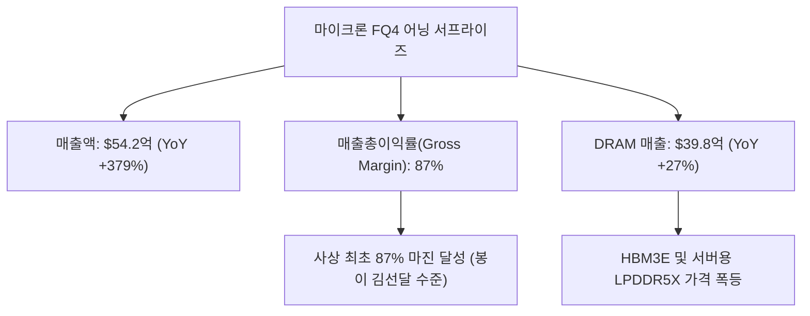
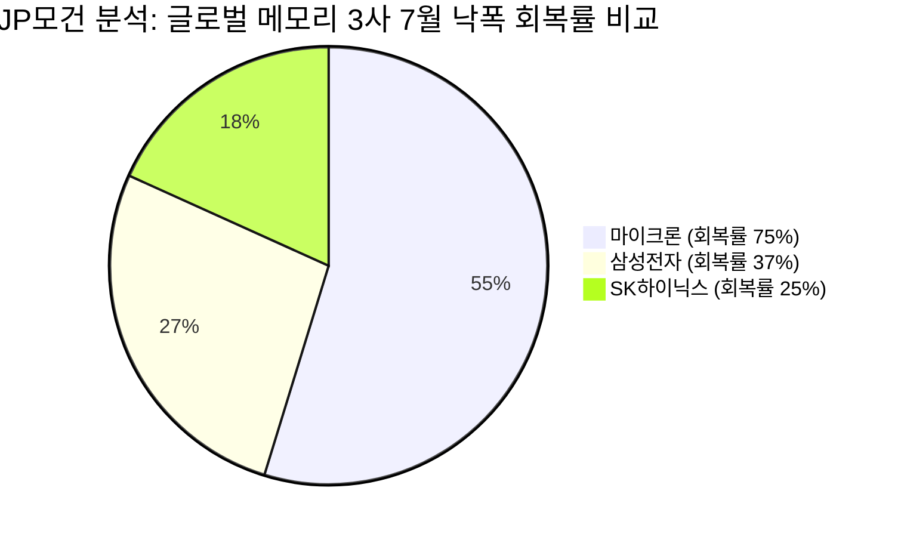

# 🎬 [김어준의 겸손은힘들다 뉴스공장 '12시에 만나요'] 마이크론 어닝 서프라이즈 & 반도체 슈퍼사이클 심층 분석

**방송 채널:** 김어준의 겸손은힘들다 뉴스공장  
**코너명:** 12시에 만나요 (1부: 정오의 머니뉴스 / 2부: 12시 사랑방)  
**방송 일자:** 2026년 10월 01일 (목요일)  
**진행자:** 메인 MC 이광수, 박시동 경제평론가(대표), 권다영 앵커  
**원본 영상:** [https://www.youtube.com/watch?v=Pz_sP9FFiBE](https://www.youtube.com/watch?v=Pz_sP9FFiBE)  

---

## 1. Executive Summary

2026년 10월 1일 방송된 **김어준의 겸손은힘들다 뉴스공장 '12시에 만나요'**는 마이크론(Micron)의 4분기 어닝 서프라이즈 발표와 10월 1일 산자부 발표 한국 9월 수출입 통계(사상 최초 월 1,200억 달러 수출 돌파)를 집중 분석하였습니다.

* **마이크론(MU) 어닝 서프라이즈 & 피크론 불식:** 매출총이익률(Gross Margin) 87%라는 역사상 전무후무한 숫자를 기록. 주가 오버나이트 보합 반응은 매크로 금리 압박과 1분기 성과급/재고 반영에 따른 착시일 뿐, 펀더멘털은 사상 최고 수준.
* **마이크론 IR의 전향적 3대 신규 멘트:** ① **2031년까지 AI 메모리 슈퍼사이클 지속 가이던스**, ② **장기계약(Long-term Contract) 고객사 26개로 확대**, ③ **클린룸(건설) 위주 Capex 투자로 무분별한 증설 자제 ➔ 고마진 유지 전략 확립**.
* **한국 반도체주(SK하이닉스·삼성전자) 극심한 디스카운트 (JP모건/골드만 뷰):** 마이크론이 전고점 대비 낙폭의 75%를 회복한 반면, SK하이닉스는 낙폭의 25%만 회복하여 향후 전고점 대비 **+65%의 독보적 상승 여력**을 보유함.

---

## 2. 1부: 정오의 머니뉴스 (이광수, 박시동, 권다영)

### 2.1 마이크론(Micron) FQ4 실적 발표 세부 분석

| 실적 지표 항목 | 마이크론 발표 수치 (FQ4) | 시장 컨센서스 (예상치) | YoY / QoQ 증감 | 비고 및 평가 |
| :--- | ---: | ---: | :--- | :--- |
| **매출액 (Revenue)** | **54.2억 달러** | 51.0억 달러 | **YoY +379%** / QoQ +31% | 어닝 서프라이즈 달성 |
| **매출 총이익률 (Gross Margin)** | **87.0%** | 86.1% | QoQ +2.1%p | **역사상 사상 최초 87% 마진 달성** |
| **DRAM 매출액** | **39.8억 달러** | - | QoQ +27% | 전체 매출의 73% 차지 (HBM3E 포함) |
| **다음 분기 가이던스 (매출)** | **61.5억 달러** | 60.0억 달러 | - | 견조한 성장세 지속 제시 |
| **다음 분기 가이던스 (마진)** | **86.25%** | 86.40% | QoQ -0.75%p | 성과급 및 제반 비용 반영 착시 (피크아웃 아님) |

#### 시장 오버나이트 보합의 진실 & 피크아웃 논란 해명
* **피크론 우려의 허구성:** 일각에서는 다음 분기 마진 가이던스가 86.25%로 0.75%p 낮아진 것을 두고 "피크아웃"이라고 주장하나, 이는 마이크론 측이 1분기에 성과급 및 일시적 재고 정리 비용을 몰아서 반영했기 때문임.
* **마이크론 경영진의 손놀림:** 마이크론 IR은 "1분기가 연중 마진 바닥이며 2분기부터는 87% 이상으로 재상승할 것"이라고 공식 확인.

---

### 2.2 마이크론 IR이 밝힌 4대 파격적 신규 모멘텀
1. **2031년까지 AI 메모리 슈퍼사이클 가이던스 공식화:** 기존 2027~2028년 보증을 넘어 주요 반도체 메이커 중 최초로 **2031년까지 공급 부족(Shortage) 장기화**를 언급.
2. **장기 계약(Long-term Contract) 수량 폭증:** 직전 분기 16개사에서 이번 분기 **26개사로 장기 계약 고객 확대**.
3. **비(非) 하이퍼스케일러 기업으로 저변 확대:** 메타, 아마존 등 빅테크 외에 일반 기업 및 중소형 컴퓨팅사들까지 더 높은 가격에 장기 계약 체결 중.
4. **스마트한 Capex 투자 전략:** 장비 수급을 무작위로 늘려 공급 과잉을 부르는 대신, 공장 껍데기(클린룸/건설) 위주로 유연하게 투자하여 반도체 ASP(평균판매단가) 고마진 유지.

---

### 2.3 미 PCE 물가, 미 국채금리(5.29%) & 한국 9월 수출입 통계
* **미 8월 PCE 물가 지수:** 헤드라인 3.4%로 예상 하회했으나, 연내 개정 산출 기준 변경(0.1~0.2%p 낮아지는 효과) 및 GDP 호조로 미 10년물 국채금리가 5.29%, 30년물이 5.6%를 터치하며 고공행진 지속.
* **한국 9월 수출입 동향 (10/1 발표 통관 잠정치):**
  * **수출:** 사상 최초 월 **1,209.4억 달러 (+83.5% YoY)** 돌파.
  * **반도체 수출:** 단일 품목 최초 월 **603억 달러 (+262.8% YoY)** 돌파 (전체 수출의 49.9%).
  * **무역수지:** **498.5억 달러 흑자** (역대 최고 기록).

---

### 2.4 반도체 소부장 ETF 컨닝 투자 전략 (이광수 팁)
* **투자 팁:** 투자는 발명하는 것이 아니라 우량 자금의 궤적을 쫓아가는 것. 국내 대표 반도체 ETF(KODEX 반도체, TIGER 반도체 등) 보유 비중에서 삼성전자/SK하이닉스를 제외한 **소부장 종목 중 최근 비중(Flow)이 꾸준히 늘어나는 종목**을 발굴해 투자하는 전략 제언.

---

## 3. 2부: 12시 사랑방 - JP모건/골드만 뷰 & 국내 메모리 디스카운트 분석

### 3.1 글로벌 IB (JP모건/골드만삭스) 분석 리포트 요약
* **마이크론 vs SK하이닉스/삼성전자 주가 회복률 격차:**
  * **마이크론 (MU):** 7월 주가 조정 이후 전고점 대비 **낙폭의 70~75% 회복** 완료. (전고점까지 +10% 상승여력)
  * **SK하이닉스 (000660):** 전고점 대비 **낙폭의 25%만 회복**한 상태. (전고점 탈환 시 **+65%의 독보적 상승 여력** 보유)
  * **삼성전자 (005930):** 전고점 대비 **낙폭의 37% 회복**한 상태. (전고점 탈환 시 **+35%의 상승 여력** 보유)

### 3.2 12시 사랑방 핵심 결론
* 한국 대표 메모리주(SK하이닉스, 삼성전자)는 실적 이익 체력(영업이익률 40%+) 대비 글로벌 시장에서 과도하게 억눌려 있는 상태.
* 마이크론의 실적 어닝 서프라이즈와 2031년 슈퍼사이클 확인은 국내 반도체 대장주 및 우량 소부장주의 강력한 주가 상향 리레이팅(Re-rating) 촉매로 작용할 것.

---

## 4. 종합 시사점 및 투자자 가이드라인

1. **마이크론 실적 착시 불식:** 1분기 가이던스 마진 소폭 하락(86.25%)에 현혹되지 말고 2031년까지 이어질 AI 메모리 수급 쇼티지에 주목.
2. **국내 반도체 대장주 밸류에이션 갭 메우기 베팅:** SK하이닉스(상승여력 +65%) 및 삼성전자(상승여력 +35%)의 밸류에이션 갭 메우기 구간 진입 시 매수 유지.
3. **반도체 소부장 ETF 유입 종목 스크리닝:** 반도체 ETF 상위 비중 증가 소부장 종목 분할 매수.
