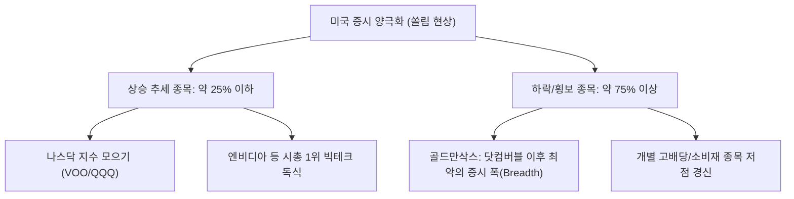
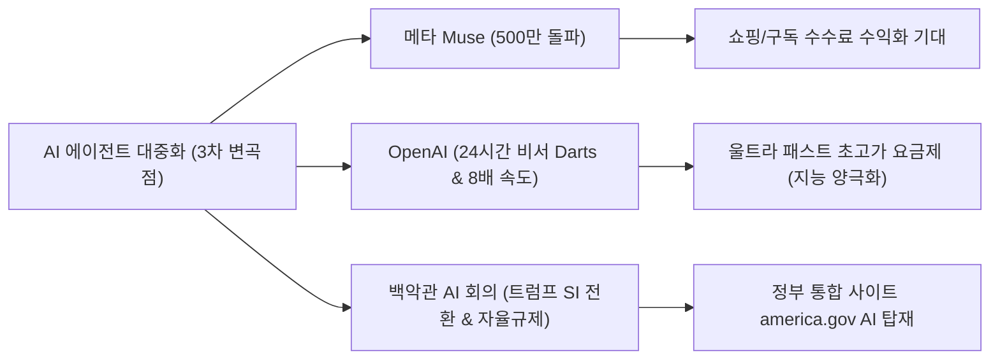

# [G] 소수몽키 일요일 라이브 증시 분석 및 주간 대응 리포트 (2026_10_05)

**작성일자:** 2026년 10월 5일  
**대상 시점:** 2026년 10월 1주차 (10월 5일 ~ 10월 11일 주간 대응)  
**분석 주체:** Gemini (Antigravity Investment Intelligence, `[G]` 접두사)  
**원본 출처:** [소수몽키 해외주식 라이브 영상 (YouTube)](http://www.youtube.com/watch?v=V3ZQ02Syf5U) | [소수몽키 채널 공개 재생목록](https://www.youtube.com/watch?v=qXuK203LR5Y&list=PL-QIFKCEb2mCPUP-7IP22EWODYGySjX52)

---

## 1. Executive Summary

### **소수몽키의 주간 한 줄 뷰**
> *"나스닥과 엔비디아만 신고가를 달리는 **'기묘한 쏠림 랠리'** 속에서 지수 착시 현상이 극심하다. 하지만 **엔비디아의 파격적 주주환원+금융/보험 연계 판 키우기**, 그리고 **AI 에이전트(비서) 대중화 3차 변곡점**이 실적 성장성을 뒷받침하므로, **나스닥/반도체 지수 ETF 적립 + 우량 빅테크 눌림목 분할 매수**로 4분기 랠리를 준비하자!"*

### **주간 핵심 요약 3가지**

1. **골드만삭스 "닷컴버블 이후 최악의 증시 폭(Breadth)" & 극단적 쏠림 현상:**  
   상승 추세에 있는 미국 종목 비율이 25% 이하로 하락하며 개별 주식 계좌의 괴리감이 극심한 상황. 나스닥 지수 및 엔비디아 보유자만 웃는 장세가 지속되고 있으며, 겉모습은 평온하나 속은 대다수 종목이 약세인 '기묘한 랠리' 전개.
2. **엔비디아(NVDA) 역대 최대 자사주 매입 & 금융·보험사 연계 '판 키우기':**  
   애플을 뛰어넘는 역대 최대 자사주 매입 발표 및 젠슨 황의 "우리 주식은 여전히 저렴하다" 선언. 기존 월가 칩 담보 대출에 이어 **보험사(Financial Times 보도)까지 영입하여 칩 손실 보증 ➔ 월가 대출 한도 확대 ➔ 네오클라우드 칩 구매 폭증**으로 이어지는 선순환 판 키우기 완성.
3. **AI 에이전트(비서) 대중화 시대 개막 (3차 변곡점) & 백악관 정책 지원:**  
   메타 '뮤즈(Muse)' 500만 다운로드 돌파, OpenAI 연례 행사의 '울트라 패스트(8배 속도)' 유료화 모델 공개, 백악관 AI 최고 리더 회의 개최(트럼프 'SI 초지능 명칭 변경' 및 자율 규제 서명) 등 AI 비서 실생활 침투 가속화.

---

## 2. 이번 주 마켓 캘린더 & 매크로 빅이벤트

| 날짜 (한국시간) | 이벤트 및 지표 발표 | 중요도 | 예상 영향 및 관전 포인트 |
|---|---|:---:|---|
| **10/5(월) 23:00** | 미 9월 ISM 서비스업 PMI 발표 | ★★★ | 고용 부진 후 서비스업 경기 둔화 여부 확인 |
| **10/6(화)** | 마벨(Marvell) 투자자의 날(Investor Day) | ★★★★ | 맞춤형 AI 칩(ASIC) 및 광통신 밸류체인 모멘텀 |
| **10/7(수) 03:00** | **미 9월 FOMC 회의록 공개** | ★★★★★ | 연준의 인상/동결 논의 강도 및 향후 금리 경로 판가름 |
| **10/7(수) ~ 10/8(목)** | 마이크로소프트 AI 연례 행사 (젠슨 황 참석) | ★★★★ | MS Copilot & 엔비디아 칩 연동 신기술 발표 |
| **10/8(목)** | **펩시코(PepsiCo) 3분기 실적 발표 (장전)** | ★★★ | 소비재 및 성숙 브랜드 원가/수요 체력 확인 (실적 시즌 개막) |
| **10/9(금)** | 대만 TSMC 9월 매출 발표 | ★★★★★ | AI 가속기 파운드리 가동률 및 엔비디아/애플 수요 실측 |
| **10/9(금)** | 델타항공(Delta Air Lines) 3분기 실적 발표 | ★★★ | 미국 서비스/여행 소비 체력 검증 |

---

## 3. 소수몽키 라이브 핵심 브리핑

### 3.1 미국 증시 극단적 쏠림 현상 & 4분기 중간선거 계절성 통계

* **지수 착시와 공포 구간:** 골드만삭스 분석에 따르면 현재 미국 증시는 닷컴버블 이후 가장 나쁜 증시 폭(Market Breadth)을 기록 중입니다. 지수 표면은 신고가 부근이지만, 전체 종목의 75%는 하락 추세 또는 횡보에 그쳐 심리 지표는 '공포 구간'에 진입해 있습니다.
* **4분기 중간선거 계절성 통계 (상승 확률 84%):** 1950년 이후 역사적으로 중간선거가 있는 해의 4분기 증시는 19번 중 16번 상승 마감했습니다. 하락했던 3번(1978년, 1994년, 2018년)은 공통적으로 '연준의 강력한 긴축'이 원인이었습니다. 연준이 무리한 긴축을 강행하지 않는 한 불확실성 해소 랠리 가능성이 높습니다.

---

### 3.2 엔비디아(NVDA) 독주 & 금융·보험사 연계 'AI 생태계 확전'

* **젠슨 황의 강렬한 인터뷰 & 자사주 매입:**  
  엔비디아는 애플을 뛰어넘는 역대 최대 자사주 매입을 발표했습니다. 젠슨 황은 인터뷰에서 *"엔비디아 주식은 여전히 저렴하다. 주식을 보유하고 계속 사라. 창출되는 막대한 현금을 자사주 매입으로 돌려주는 것이 가장 현명한 사용법이다"*라고 주주환원 의지를 피력했습니다.
* **보험사(Financial Times 보도)까지 참전한 컴퓨팅 담보 대출:**  
  - 기존: 월가 금융사와 칩 담보 대출(반도체 담보 펀딩) 협약.
  - 신규: 엔비디아가 중고 칩 가격 방어 데이터를 보험사에 제공 ➔ 보험사가 칩 손실 보증 상품 출시 ➔ 월가가 대출 한도 확대 ➔ 자금 부족 스타트업/네오클라우드가 더 많은 엔비디아 칩 및 데이터센터 구매.
  - 이 구조를 통해 엔비디아는 AI 가속기 시장의 판을 기하급수적으로 키우고 있습니다.

---

### 3.3 AI 에이전트(비서) 대중화 3차 변곡점 & 백악관 정책 모멘텀

1. **메타 '뮤즈(Muse)' 폭발적 흥행:** 캐나다·미국 출시 후 500만 다운로드를 초단기 돌파하며 챗GPT 500만 달성 속도를 압도. 쇼핑 수수료 및 서비스 구독을 통한 2030년 매출 기여도 8~10% 전망.
2. **OpenAI 연례 행사 & '울트라 패스트(Ultra Fast)' 요금제:** 샘 알트먼은 채봇에서 '24시간 자율 AI 비서(Darts)'로의 전환을 선언. 8배 속도의 '울트라 패스트' 부스터 옵션(월 500달러 이상 최상위 요금제)을 선보이며 지능의 초양극화를 유도.
3. **백악관 AI 회의 & 트럼프 정책 지원:** 트럼프 대통령은 백악관에 젠슨 황, 일론 머스크, 샘 알트먼 등 AI 리더들을 소집해 AI 명칭을 **SI(Super Intelligence, 초지능)** 로 변경하고 강제 규제 대신 **자율 규제** 서명을 진행. 미국 정부 통합 사이트(`america.gov`)에 구글 제미나이와 스페이스X 그록 탑재 공식 확인.

---

## 4. 주간 포커스 종목 & 관전 포인트

| 종목명 (티커) | 소수몽키 뷰 & 핵심 포인트 | 핵심 체크포인트 |
|---|---|---|
| **엔비디아 (NVDA)** | **[Top Pick]** 시총 1위 달성 후에도 독주. 자사주 매입+보험사 펀딩 연계로 실적 가시성 장기화. | 자사주 매입 집행 및 MS 연례 행사 젠슨 황 멘트 |
| **메타 (META)** | **[Top Pick]** AI 에이전트 '뮤즈' 흥행으로 AI 서비스 대중화 선도. | 500만 다운로드 후 쇼핑/구독 수익화 진행 속도 |
| **마이크로소프트 (MSFT)** | **[우량 매수]** Copilot 개편 및 10/7~8 연례 행사에서 젠슨 황과 AI 시너지 과시. | AI 클라우드 매출 전환 속도 및 연례 행사 신제품 |
| **팔로알토 (PANW)** | **[관심주]** AI 에이전트 실생할 침투에 따른 보안 이슈 부각 1순위 수혜주. | 백악관 보안 자율 협약 및 기관 매집 흐름 |
| **나스닥 ETF (QQQ/VOO)** | **[핵심 적립]** 쏠림 장세에서 개별주 스트레스를 줄이는 가장 안전하고 확실한 대응책. | 미 국채금리 5.2%선 안정 여부 |
| **앤트로픽 (Anthropic)** | **[IPO 관찰]** 11월 추수감사절(11/23~25) 전 상장 유력. 10월 중순 투자자 미팅 개최. | IPO 세부 공모가 및 밸류에이션 |

---

## 5. 개인 투자자를 위한 주간 실전 행동 가이드

1. **내 주식만 안 오르는 쏠림 장세 스트레스 관리:**  
   개별 주식 75%가 하락/횡보하는 기묘한 장세이므로, 본인 포트폴리오 탓만 하지 말고 **나스닥100(QQQ/TQQQ) 및 S&P500(VOO) 지수 ETF 비중을 확충**하여 지수 상승 과실을 함께 누리는 전략을 취하세요.
2. **AI 에이전트 밸류체인 핵심주(NVDA, META, MSFT) 눌림목 분할 매수:**  
   AI 경쟁이 10일마다 신모델이 나올 정도로 격화되고 있습니다. 칩을 파는 엔비디아와 서비스를 선점한 메타/MSFT 중심의 탑티어 우량주 위주로 눌림목 분할 매수를 유지하세요.
3. **4분기 계절성 랠리 대기:**  
   10월부터 중간선거 불확실성이 해소되는 4분기 통계적 상승 장세에 접어듭니다. 단기 변동성 뉴스(도시바 메모리 증설 등)에 일희일비하지 말고 연말 안도 랠리를 목표로 적립식 매수를 지속할 것을 권장합니다.

---

*※ **출처:** 소수몽키 유튜브 공개 영상 (`http://www.youtube.com/watch?v=V3ZQ02Syf5U`), 소수몽키 해외주식 공개 재생목록, Financial Times (엔비디아-보험사 협약), Goldman Sachs Market Breadth 보고서, 백악관 AI 회의 발표 공시, 미 노동부 및 FRED 지표. 모든 투자 판단의 최종 책임은 투자자 본인에게 있습니다.*
