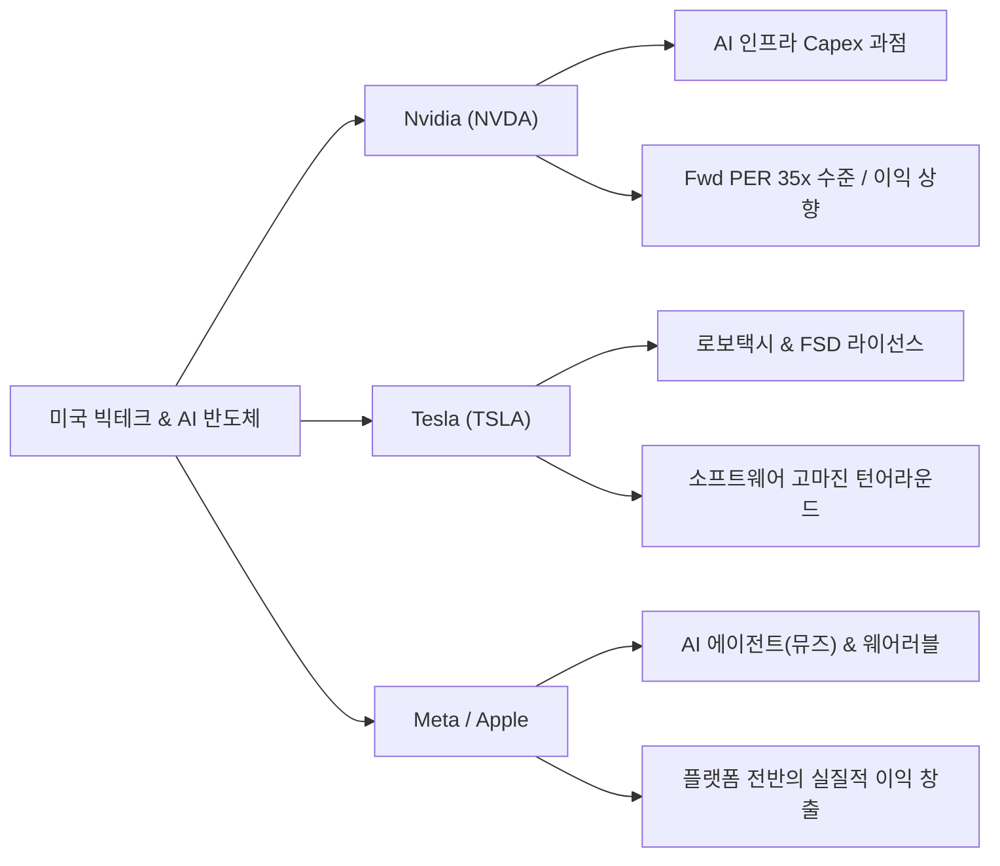
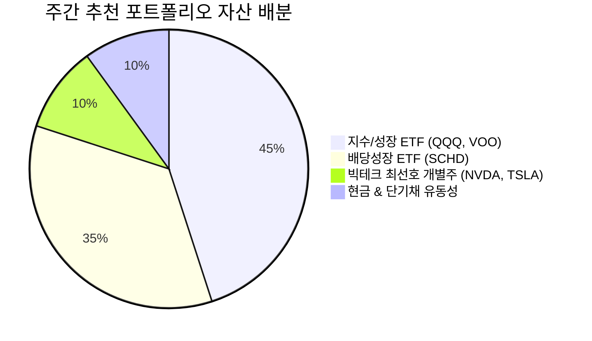

# 🎬 [슈페TV 요약 리포트] 주간 미국 증시 분석 및 월가(Wall Street) 리포트 종합

**분석 기준일:** 2026년 09월 28일 (`2026_09_28`)  
**작성일자:** 2026년 09월 30일  
**분석 주체:** Claude (`[C]` 접두사 — `.agent/rules/report_naming.md`)  
**원본 출처:** [슈페TV 유튜브 공식 채널 (https://www.youtube.com/@supe-tv/videos)](https://www.youtube.com/@supe-tv/videos)  

---

## 1. Executive Summary

2026년 9월 말 기준 미국 증시는 **고금리 장기화(미 국채 10년물 5.2% 터치, 30년 모기지 금리 7.12%)** 및 **9월 계절적 변동성 장세** 속에서 월가 주요 투자은행(IB)들의 뷰와 슈페TV 분석이 일치하는 방향으로 전개되고 있습니다. 

### 슈페TV 주간 브리핑 핵심 요약 3가지 & 월가 스탠스
1. **월가 주요 IB 스탠스 (중립적 우호 유지):** 골드만삭스, 모건스탠리, BofA 등 글로벌 투자은행들은 고금리 여파로 지수 전체의 일률적 상승보다는 **'실적 확실성이 검증된 M7 빅테크 차별화'**와 **'우량 배당주/ETF를 통한 수비 포트폴리오 구축'**을 강조하고 있습니다.
2. **빅테크 & AI 성장 모멘텀 재점화:** 엔비디아(NVDA)의 차세대 AI 칩 인프라 수요 독점과 테슬라(TSLA)의 로보택시 및 소프트웨어 반복 매출 모멘텀으로 뱅크오브아메리카(BofA) 등의 목표가 상향 소식이 이어졌으며, 단기 시장 조정은 우량주 분할 매수 기회로 평가됩니다.
3. **공격과 수비의 완벽한 밸런스 (QQQ + SCHD):** 시장 변동성에 대응하기 위해 나스닥100 중심의 공격수(**QQQ**)와 안정적 현금 흐름 및 하방 지지력을 제공하는 수비수(**SCHD**)를 적절히 배분하는 바벨(Barbell) 전략이 개인 투자자에게 가장 유효한 가이드라인입니다.

---

## 2. 월가(Wall Street) 주요 보고서 & 매크로 핵심 정리

| 글로벌 IB / 기관 | 주요 투자의견 및 목표가 동향 | 핵심 분석 및 논리 | 시장 시사점 |
| :--- | :--- | :--- | :--- |
| **Goldman Sachs** | S&P 500 **Overweight** (목표가 유지) | 빅테크 M7의 이익 창출력과 빅테크 Capex 지출 지속성 강세 지지 | 지수 조정 시 대형 테크주 매수 기회 |
| **Morgan Stanley** | 시장 **Neutral** / 우량주 선별 접근 | 고금리 부담 지속에 따른 밸류에이션(P/E) 부담주 경고 | 실적 미달성 중소형주 디스카운트 지속 |
| **Bank of America** | **Tesla (TSLA)** 목표가 상향 | 로보택시, FSD 라이선싱 등 소프트웨어 반복 매출 가치 반영 | 자동차 제조사를 넘어 AI/로봇기업 평가 |
| **JP Morgan** | **Nvidia (NVDA)** **Overweight** | 차세대 AI 칩(블랙웰 등) 수요 초과 상태 및 파이프라인 견조 | AI 인프라 반도체 독주 체제 재확인 |

### 주요 매크로 지표 체크 (2026년 9월 말 기준)
* **미 국채 10년물 금리:** **5.20% 수준 터치** (고금리 환경 하방 경직성 상존)
* **30년 고정 모기지 금리:** **7.12%** (미국 주택 시장 착공 건수 완만한 둔화)
* **WTI 국제 유가:** **배럴당 $93 상회** (중동 군사 긴장 여파로 물가 압박 요소 작용)
* **이번 주 핵심 마켓 이벤트:** 마이크론(Micron) 3Q 실적 발표 (10/1), 미국 8월 PCE 물가지수 및 9월 고용보고서 (10/2)

---

## 3. 슈페TV 섹터 & ETF 심층 분석

### 3.1 빅테크 & AI 반도체 동향 및 밸류에이션

* **엔비디아 (NVDA):** 글로벌 빅테크 기업들의 AI Capex 지출이 2026년에도 축소되지 않고 확대되면서 차세대 GPU 파이프라인 수요가 견조합니다. 12M Fwd PER은 과거 대비 합리적인 30배 후반 수준으로 평가됩니다.
* **테슬라 (TSLA):** 단순 전기차 인도량을 넘어 FSD(완전자율주행) 버전 업그레이드와 로보택시 시범 서비스 개시에 따른 소프트웨어 고마진 매출 비중 확대가 월가의 주요 평가 요소로 전환되었습니다.
* **메타 (META) & 애플 (AAPL):** 메타의 AI 에이전트 '뮤즈(Muse)' 300만 다운로드 달성과 애플의 AI 온디바이스 칩 탑재로 플랫폼 기업들의 실질적 수익 모델 전환이 진행 중입니다.

---

### 3.2 배당성장주 & 지수 ETF (SCHD, QQQ, VOO) 매수/매도 타이밍 점검

| 구분 | ETF 티커 | 역할 / 투자 성격 | 현재 배당수익률 / 특성 | 추천 포트폴리오 비중 | 적정 매수/대응 가이드라인 |
| :--- | :--- | :--- | :--- | :---: | :--- |
| **공격수** | **QQQ** | 나스닥 100 (빅테크 성장) | 배당률 ~0.6% / 고성능 성장 | **30% ~ 40%** | 50일 이평선 터치 시 적립식 분할 매수 |
| **코어** | **VOO** | S&P 500 (미국 시장 전체) | 배당률 ~1.4% / 시장 평균 | **20% ~ 30%** | 거시경제 변동성 국면마다 주 단위 분할 적립 |
| **수비수** | **SCHD** | 배당성장 (우량 100개 기업) | 배당률 **~3.6%** / 배당성장 10% | **30% ~ 40%** | 주가 하락 시 배당수익률 극대화 구간 매수 |
| **현금** | **CMM / 단기채** | 유동성 및 마진 확보 | 연 4.5%~5.0% 약정 이자 | **10% ~ 15%** | 시장 급락 시 저가 매수용 대기 자금 |

#### SCHD vs QQQ 수비와 공격의 조화 (Barbell Strategy)
* **QQQ (성장 동력):** 기술주 중심의 강력한 상승 파동을 추종하나 고금리 및 매크로 악재 시 변동성이 커질 수 있음.
* **SCHD (현금흐름 방어):** 장기 우량 재무구조 기업 100개 분산으로 하락장에서 주가 하방 경직성을 제공하고, 연 10% 수준의 배당 성장으로 안정적 현금 흐름을 재투자할 수 있음.

---

### 3.3 주간 히트맵 및 자금 유출입 핵심 차트 분석
* **자금 유입 섹터:** AI 반도체(NVDA, AVGO), 대형 빅테크(META, AMZN), 미국 우량 배당성장 ETF(SCHD).
* **자금 유출 섹터:** 고금리 장기화 부담을 받는 중소형주(Russell 2000 / IWM) 및 재무구조가 취약한 순수 전기차 스타트업.

---

## 4. 주간 포커스 종목 & 관전 포인트

### 1. 마이크론 테크놀로지 (Micron Technology - MU)
* **관전 포인트:** 10월 1일 목요일 오전 6시(한국시간) 발표될 3분기 실적에서 HBM3E 공급 스케줄 및 메모리 반도체 턴어라운드 폭 확인.
* **월가 뷰:** AI 서버용 고성능 메모리 공급 부족으로 서프라이즈 기대감 우세.

### 2. 테슬라 (Tesla - TSLA)
* **관전 포인트:** 로보택시 상용화 일정 및 FSD 수수료 매출 증가 추세.
* **월가 뷰:** 뱅크오브아메리카(BofA) 목표가 상향 리포트 발간 이후 기관 패시브 자금 재유입 여부.

### 3. 알트리아 / 오리온 리츠 / JEPI (고배당 커버드콜)
* **관전 포인트:** 국채 금리 5.2% 고점 형성 시 고배당주(연 7~9% 배당률)의 채권 대체 투자 매력 부각.

---

## 5. 개인 투자자를 위한 주간 미국 주식 실전 대응 가이드

### 5.1 추천 포트폴리오 비중 모델

### 5.2 실전 행동 가이드라인
1. **9월 말~10월 초 계절적 변동성 활용:** 9월 말 국채 금리 및 고유가 이슈로 지수가 일시적 조정을 받을 때는 공포에 매도하기보다 **QQQ 및 SCHD 적립식 분할 매수** 기회로 활용하세요.
2. **마이크론 실적 발표 직후 반도체 섹터 대응:** 10월 1일 마이크론 실적 결과에 따라 엔비디아, 브로드컴 등 AI 반도체 체인의 추가 상승 여력이 결정되므로 발표 직후 수급 확인 후 대응하세요.
3. **현금 비중 10~15% 유지:** 미 연준의 금리 인하 속도 조율 및 10월 PCE 물가지수 발표 전까지는 10% 이상의 대기 현금을 확보하여 갑작스러운 시장 하락에 대비하세요.
